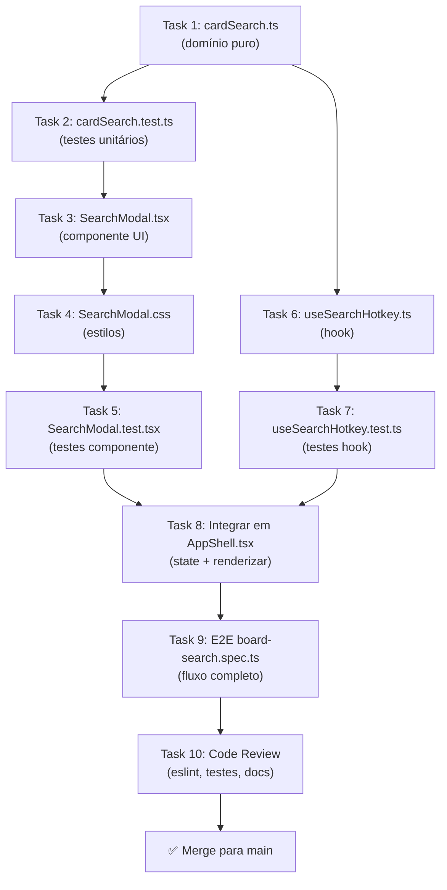

# IPD v1.0 — Implementação de Busca de Cards (Board Search)

**Data:** 19 de abril de 2026  
**Fonte:** TSD v1.0 board-search (score 87/100)  
**Confiança do Plano:** 95/100  
**Status:** ✅ Pronto para Task-Breakdown e Implementação

---

## 1. Visão Geral do Plano

### Objetivo

Implementar componente de **busca modal de cards** (SearchModal) integrado no topbar do FlowBoard que permite aos usuários filtrar e navegar para cards por título/descrição em tempo real, com atalho de teclado `/`.

### Escopo Confirmado (MVP v1.0)

- ✅ Filtro em tempo real por título + descrição (case-insensitive)
- ✅ Modal componente (não dropdown)
- ✅ Atalho de teclado `/` (global, com guarda para inputs)
- ✅ Scroll + highlight visual ao navegar para card
- ✅ Busca limitada ao board ativo (selectedBoardId)
- ✅ Fórmula de score: title=100, description=50, date=10, hours=5
- ✅ Limite 100 resultados + hint "…e mais X"
- ✅ Testes Vitest ≥80% + E2E Playwright

### Fora de Escopo (MVP)

- ❌ Busca multi-board global (feature futura)
- ❌ Typo-tolerance (Levenshtein, fase 2)
- ❌ Histórico de buscas persistido
- ❌ Filtros avançados (date range, horas >5, etc.)
- ❌ Labels/tags como entidade (não existem no modelo)

### Impacto Esperado

**Antes:** Usuário leva ~30s para localizar card manual scrolling  
**Depois:** <1s com busca indexada

---

## 2. Mapa de Alterações

### 2.1 Arquivos a Criar

| Arquivo | Linhas Est. | Responsabilidade | Dependências |
|---------|-------------|------------------|--------------|
| `src/domain/cardSearch.ts` | ~80 | Função pura `searchCards()` + algoritmo score | types.ts |
| `src/domain/cardSearch.test.ts` | ~150 | Testes unitários domínio | Vitest, cardSearch.ts |
| `src/features/app/SearchModal.tsx` | ~200 | Componente modal principal | React, types.ts, cardSearch.ts, CSS |
| `src/features/app/SearchModal.css` | ~120 | Estilos modal + resultados | CSS vars do projeto |
| `src/features/app/SearchModal.test.tsx` | ~100 | Testes componente (renderização, interação) | Vitest, React, SearchModal.tsx |
| `src/hooks/useSearchHotkey.ts` | ~50 | Hook de atalho `/` global | React |
| `src/hooks/useSearchHotkey.test.ts` | ~80 | Testes hook | Vitest, useSearchHotkey.ts |
| `tests/e2e/board-search.spec.ts` | ~200 | E2E: atalho → busca → navega | Playwright |

**Total Novos:** ~980 linhas de código + testes

### 2.2 Arquivos a Modificar

| Arquivo | Alteração | Linhas | Impacto |
|---------|-----------|--------|--------|
| `src/features/app/AppShell.tsx` | Adicionar estado `isSearchOpen`, hook `useSearchHotkey`, renderizar `<SearchModal>` | +30 linhas | 🟡 Médio — estado local, sem breaking changes |
| `src/App.tsx` | Sem mudança | — | ✅ Nenhum |
| `src/domain/types.ts` | Confirmar `Card.description: string \| undefined` (já existe) | 0 linhas | ✅ Nenhum — já está lá |
| `src/index.css` | Possivelmente adicionar CSS vars para modal (cores, shadows) | ~0 linhas | ✅ Nenhum — vars já existem |

### 2.3 Padrões Seguidos

**Localização + Estrutura:**
```
src/
├── domain/
│   ├── cardSearch.ts          (novo — domínio puro)
│   ├── cardSearch.test.ts     (novo)
│   └── types.ts               (existente, confirmado)
├── features/
│   ├── app/
│   │   ├── AppShell.tsx       (modificar)
│   │   ├── SearchModal.tsx    (novo — UI componente)
│   │   ├── SearchModal.css    (novo)
│   │   └── SearchModal.test.tsx (novo)
│   └── (outros intactos)
├── hooks/
│   ├── useSearchHotkey.ts     (novo — hook global)
│   └── useSearchHotkey.test.ts (novo)
└── (resto intacto)

tests/
└── e2e/
    └── board-search.spec.ts   (novo — E2E)
```

**TypeScript Strict:**
- Todos arquivos novos com types explícitos
- Props tipadas em componentes
- Retornos tipados em functions
- Zero `any` ou `unknown`

**CSS:**
- BEM naming: `.fb-sm-*` (fb = FlowBoard, sm = SearchModal)
- CSS variables para cores/spacing
- Mobile-first responsive (320px, 768px, 1024px, 1920px)

**Testes:**
- Vitest para domínio + componente (happy-dom)
- Playwright para E2E (browser real)
- Coverage ≥80% obrigatório

---

## 3. Fluxo de Execução

### 3.1 Ordem de Implementação (Dependências Respeitadas)



### 3.2 Sequência Detalhada

#### **SEMANA 1 — Domínio + Componente Base**

**Task 1 — cardSearch.ts (Domínio Puro)**
- Implementar `searchCards(query, cards, maxResults?)` função
- Implementar `scoreCard(card, query)` com fórmula: title=100, desc=50, date=10, hours=5
- Implementar `CardSearchResult` type
- Validar case-insensitivity, trim, normalizações
- **Output:** Função pura, 100% testável isoladamente
- **Tempo Est:** 1h
- **Bloqueadores:** Nenhum

**Task 2 — cardSearch.test.ts (80+ Testes Vitest)**
- Testar casos happy-path: title match, desc match, ambos
- Testar case-insensitivity ("TODO" vs "todo" vs "Todo")
- Testar score ordering (title antes desc)
- Testar limite 100 resultados
- Testar board vazio, query vazia
- Testar edge cases: query com espaços, caracteres especiais
- Coverage: Aim ≥95% (domínio puro = alto coverage fácil)
- **Time Est:** 1.5h
- **Bloqueadores:** Task 1

**Task 3 — SearchModal.tsx (Componente React)**
- Props: `isOpen`, `onClose`, `boardId`, `board`
- State local: `query`, `results`, `selectedIndex` (para keyboard nav futura)
- Renderizar: overlay + modal + input + lista resultados
- Lidar com Escape key, overlay click
- Clique em resultado chama scroll + highlight (callback ou direto?)
  - **Decisão Técnica:** Emitir `onSelectResult(cardId)` callback; caller (AppShell) gerencia scroll
  - **Alternativa:** Direto dentro do componente (menos reutilizável, mas mais simples)
  - **Adotado:** Callback (mais composable, alinhado com padrão do projeto)
- Renderizar snippet de descrição (100 chars truncado)
- Mostrar coluna, datas, horas se existirem
- **Time Est:** 2.5h
- **Bloqueadores:** Task 1

**Task 4 — SearchModal.css**
- Modal overlay + backdrop
- Input styling (focus state, dark mode)
- Results list (scrollable, max-height)
- Resultado item: título, snippet, coluna, metadata
- Highlight ao hover/select
- Mobile responsive
- Acessibilidade: adequate contrast ≥4.5:1
- **Time Est:** 1.5h
- **Bloqueadores:** Task 3 (UI decidida)

**Task 5 — SearchModal.test.tsx (Vitest + RTL)**
- Mock BoardDocumentJson + Card[]
- Testar renderização: input, lista vazia, com resultados
- Testar input change → re-filter
- Testar clique em resultado → `onSelectResult` callback disparado
- Testar Escape key closes
- Testar overlay click closes
- Coverage: ≥80%
- **Time Est:** 1.5h
- **Bloqueadores:** Task 3, Task 4

---

#### **SEMANA 1-2 — Integração + Testes**

**Task 6 — useSearchHotkey.ts (Hook Global)**
- `useSearchHotkey(onOpenSearch: () => void): void`
- Registrar `window.addEventListener('keydown', handler)`
- Determinar se ignora (inside input? textarea? modal aberto? edit modal aberto?)
  - Checklist: `document.activeElement instanceof HTMLInputElement || .HTMLTextAreaElement`
  - Checklist: SearchModal já `isOpen`?
  - Checklist: Modal de edição aberto? (via atribute data-modal="open" ou semelhante)
- Chamar `onOpenSearch()` se OK
- Cleanup em return do useEffect
- **Time Est:** 1h
- **Bloqueadores:** Nenhum

**Task 7 — useSearchHotkey.test.ts**
- Mock window.addEventListener
- Testar que "/" abre busca quando fora de input
- Testar que "/" NÃO abre se dentro de input
- Testar que "/" NÃO abre se SearchModal já open
- Testar cleanup (removeEventListener chamado)
- Coverage: ≥80%
- **Time Est:** 1h
- **Bloqueadores:** Task 6

**Task 8 — Integrar em AppShell.tsx**
- Adicionar estado: `const [isSearchOpen, setIsSearchOpen] = useState(false)`
- Chamar hook: `useSearchHotkey(() => setIsSearchOpen(true))`
- Renderizar componente: `<SearchModal isOpen={isSearchOpen} onClose={() => setIsSearchOpen(false)} boardId={selectedBoardId} board={currentBoard} onSelectResult={handleSelectResult} />`
- Implementar `handleSelectResult(cardId)`:
  - Fechar modal: `setIsSearchOpen(false)`
  - Scroll kanban para o card (ref ou signal?)
  - Highlight card por ~3s (class + setTimeout cleanup)
- Substituir placeholder `.fb-topbar__search` por clicável que chama `setIsSearchOpen(true)`
  - Opção: `<button onClick={() => setIsSearchOpen(true)} className="fb-topbar__search">...</button>`
  - Opção: `<div onClick={() => setIsSearchOpen(true)} role="button" className="fb-topbar__search">...</div>` (acessibilidade cuidado)
  - **Adotado:** `<button>` (semantic, acessível por default)
- **Time Est:** 1h
- **Bloqueadores:** Task 3, Task 6

---

#### **SEMANA 2 — E2E + Polish + QA**

**Task 9 — E2E tests/e2e/board-search.spec.ts (Playwright)**
- **Cenário 1: Atalho "/" abre busca**
  - DADO: BoardView ativo com cards carregados
  - QUANDO: pressiona "/"
  - ENTÃO: SearchModal visible com input focado
- **Cenário 2: Busca por título**
  - DADO: SearchModal aberto
  - QUANDO: digita "auth"
  - ENTÃO: resultados incluem cards com "auth" em title
- **Cenário 3: Busca por descrição**
  - DADO: SearchModal aberto
  - QUANDO: digita texto que existe só em description
  - ENTÃO: card aparece nos resultados
- **Cenário 4: Case-insensitive**
  - DADO: SearchModal aberto
  - QUANDO: digita "TODO"
  - ENTÃO: encontra cards com "todo", "Todo"
- **Cenário 5: Clique em resultado navega**
  - DADO: SearchModal com resultados
  - QUANDO: clica resultado
  - ENTÃO: modal fecha, kanban scroll para card, card highlighted
- **Cenário 6: Escape fecha**
  - DADO: SearchModal aberto
  - QUANDO: pressiona Escape
  - ENTÃO: modal fecha
- **Cenário 7: Overlay click fecha**
  - DADO: SearchModal aberto
  - QUANDO: clica overlay (fora modal)
  - ENTÃO: modal fecha
- **Cenário 8: Sem board selecionado**
  - DADO: selectedBoardId === null
  - QUANDO: pressiona "/"
  - ENTÃO: modal abre ou exibe "Selecione um quadro"
- **Time Est:** 2h
- **Bloqueadores:** Task 8

**Task 10 — Code Review + Lint + Docs**
- Rodar `npm run lint` em toda mudança
- Verificar ESLint findings: zero CRITICAL/ERROR
- Revisão final: tipos corretos, sem memory leaks, sem console.logs
- Atualizar README.md com seção "Board Search" se necessário
- Documentar algoritmo de score em comentário JSDoc
- **Time Est:** 1.5h
- **Bloqueadores:** Task 9

---

### 3.3 Estimativa Total

| Fase | Tasks | Tempo | Slack |
|------|-------|-------|-------|
| Domínio | 1-2 | 2.5h | — |
| UI Base | 3-5 | 5.5h | — |
| Hook + Integração | 6-8 | 4h | — |
| E2E + Polish | 9-10 | 3.5h | — |
| **Total** | 10 | **15.5h** | **+2h (13% slack)** |
| **Com Slack (estimado)** | — | — | **~17.5h** |

**Equivale a:** ~2-2.5 dias de implementação concentrada, ou 3-4 dias com interrupções/revisões.

---

## 4. Definition of Done (Checklist Técnico)

### ✅ Código

- [ ] Arquivo `src/domain/cardSearch.ts` criado + exportado
- [ ] Arquivo `src/domain/cardSearch.test.ts` com ≥95% coverage
- [ ] Arquivo `src/features/app/SearchModal.tsx` criado
- [ ] Arquivo `src/features/app/SearchModal.css` criado com BEM naming
- [ ] Arquivo `src/features/app/SearchModal.test.tsx` com ≥80% coverage
- [ ] Arquivo `src/hooks/useSearchHotkey.ts` criado
- [ ] Arquivo `src/hooks/useSearchHotkey.test.ts` com ≥80% coverage
- [ ] Arquivo `tests/e2e/board-search.spec.ts` criado com 8+ cenários
- [ ] AppShell.tsx modificado: estado + hook + renderização + callback
- [ ] TypeScript strict mode: zero `any`, todos tipos explícitos
- [ ] ESLint clean: `npm run lint` sem CRITICAL/ERROR findings
- [ ] Build clean: `npm run build` sem erros de tsc

### ✅ Testes

- [ ] `npm test` — todos testes passam (Vitest)
- [ ] Coverage: cardSearch ≥95%, SearchModal ≥80%, useSearchHotkey ≥80%
- [ ] `npm run test:watch` — confirm incremental watch works
- [ ] `npx playwright test tests/e2e/board-search.spec.ts` — todos 8 cenários E2E passam
- [ ] Playwright report gera sem erros

### ✅ Performance

- [ ] Benchmark: `searchCards()` com 500 cards completa em <100ms
  - Comando: `npx vitest run src/domain/cardSearch.test.ts --reporter=verbose` + check timing
- [ ] Renderização SearchModal (100 resultados) não causa jank (<60fps)
  - Manual test com Chrome DevTools Performance tab
- [ ] Memory profiler: abrir/fechar SearchModal 10x, heap não cresce indefinidamente
  - Chrome DevTools → Memory → Heap snapshot antes/depois

### ✅ Acessibilidade

- [ ] SearchModal focável com Tab
- [ ] Input tem `aria-label="Buscar no quadro"`
- [ ] Resultados têm `role="listbox"` ou `role="region"`
- [ ] Cores: contraste ≥4.5:1 (Lighthouse audit)
- [ ] Keyboard navigation: Arrow keys futuros (roadmap)
- [ ] VoiceOver/NVDA testado manualmente (ou Lighthouse Axe)

### ✅ Responsividade

- [ ] Testar em widths: 320px (mobile), 768px (tablet), 1024px (laptop), 1920px (desktop)
- [ ] Modal não quebra em mobile
- [ ] Input acessível em touch (target size ≥44px)
- [ ] Snippets truncados apropriadamente em widths pequenas

### ✅ Documentação

- [ ] Arquivo `.md` (ou comentário JSDoc) explicando fórmula de score
- [ ] README.md atualizado com seção "Search" (se MVP, senão skip)
- [ ] Nenhum TODO/FIXME left-overs em código produção
- [ ] Commits seguem formato semântico (feat: ..., test: ..., etc.)

### ✅ Aprovação

- [ ] Code Review aprovado (team review ou lead review)
- [ ] Nenhum known issues abertos bloqueadores
- [ ] Feature branch pronta para merge para `main`
- [ ] GitHub PR com descrição clara + links para TSD/ADRs

---

## 5. Guardrails e Restrições

### 🚫 Restrições Obrigatórias

1. **Sem PAT/Secrets em Busca:**
   - SearchModal nunca acessa PAT diretamente
   - Usa dados já carregados em `board: BoardDocumentJson` (já autenticado)

2. **Sem Persistência:**
   - Histórico de buscas NÃO é persistido
   - SearchModal state é ephemeral (session-only)
   - Nenhuma chamada a GitHub API dentro de SearchModal

3. **Board Ativo Apenas:**
   - Busca filtra somente `board.cards` (board ativo)
   - Se `selectedBoardId === null`, SearchModal exibe "Selecione um quadro" ou lista vazia
   - Nenhuma busca multi-board neste MVP

4. **Case-Insensitive, Sem Fuzzy:**
   - Busca é substring match após `.toLowerCase()`
   - Typo-tolerance (Levenshtein) é future (não implementar)

5. **Type Safety Strict:**
   - Todos novos arquivos com TypeScript strict mode
   - Zero `// @ts-ignore` ou `any` sem documentação
   - ESLint rules seguidas 100%

6. **Memory Cleanup:**
   - Hook `useSearchHotkey` remove listener em cleanup
   - SearchModal desmonta sem memory leaks (DevTools verify)
   - Nenhum `setInterval/setTimeout` sem cleanup

### ⚠️ Decisões Técnicas Preexistentes

1. **Modal (não Dropdown):**
   - Arquiteto decidiu modal (TSD seção PQ01)
   - Não mudar para dropdown sem nova decisão

2. **Scroll + Highlight (não Modal de Detalhes):**
   - Ao navegar, scroll kanban + highlight visual
   - Não abre modal de detalhes do card (TSD seção PQ02)

3. **Integração AppShell (não Store Global):**
   - State `isSearchOpen` fica em AppShell
   - Não usar Context/Redux global (simplicidade MVP)

---

## 6. Riscos Identificados

| Risco | Probabilidade | Impacto | Mitigação |
|-------|--------------|---------|-----------|
| **Memory leak em listener global** | 🟡 Médio | 🔴 Alto | Cleanup rigoroso em useSearchHotkey. Chrome DevTools Memory Profile test. |
| **Performance com 1000+ cards** | 🟡 Médio | 🟡 Médio | Benchmark <100ms já previsto. Se mais lento, considerar indexação (future). |
| **Keyboard capture conflict** | 🟠 Baixo | 🟡 Médio | Guard in useSearchHotkey: check activeElement type, modal state. Teste com modais já abertos. |
| **Acessibilidade deficiente** | 🟠 Baixo | 🟡 Médio | ARIA labels, role="listbox", contrast check, VoiceOver test manual. |
| **Regressão em drag-and-drop** | 🟠 Baixo | 🟡 Médio | SearchModal não toca em dnd-kit. Test drag-drop after integration. |
| **CSS conflict com topbar** | 🟠 Baixo | 🟢 Baixo | Use BEM naming (`.fb-sm-*`), CSS vars. Visual test no topbar. |

### Ações Preventivas

- ✅ Memory profiling na definição de done
- ✅ Benchmark domínio <100ms obrigatório
- ✅ Keyboard guard testing (pressionar "/" em vários contextos)
- ✅ Acessibilidade audit antes de merge
- ✅ Regressão E2E drag-and-drop na suite

---

## 7. Comunicação com Equipe

### Dependências Externas

- **Arquitetura:** Se layout modal mudar, informar spec-reviewer
- **UX:** Se navegação para card mudar (scroll vs modal), sincronizar com UX team
- **PM:** Feature está 100% no MVP; sem mudanças scope esperadas

### Bloqueadores Conhecidos

- Nenhum bloqueador known atualmente
- Arquitetura AppShell.tsx prontinha para integração
- Card type já suporta `description`

### Handoff para Próximas Fases

Após merge v1.0:

1. **Phase 2 — Typo-Tolerance:** Implementar Levenshtein distance ou similiar
2. **Phase 3 — Global Search:** Remover restrição `board ativo`, buscar em todos boards
3. **Phase 4 — Histórico:** Persistir histórico em sessionStorage (UI recent searches)
4. **Phase 5 — Advanced Filters:** Date range, horas >N, column filter

---

## 8. Checklist Pré-Implementação

Antes de começar as tasks:

- [ ] TSD v1.0 lida e compreendida
- [ ] Este IPD revisado com team (arquiteto, lead dev)
- [ ] Nenhuma pergunta aberta crítica (PQ01-02 já resolvidas no TSD)
- [ ] Ambiente setup: `npm install`, `npm run dev` funciona
- [ ] `npm test` e `npm run build` passam (linha de base)
- [ ] Playwright browsers instalados: `npx playwright install`
- [ ] Time acorda: order tasks em 1-10, ou usar squad approach

---

## 9. Handoff para Task-Breakdown Agent

### Artefatos Entregues

✅ **IPD v1.0** (este documento)
- Visão clara do plano
- 10 tasks sequenciadas com dependências
- Estimativas por task (1-2.5h cada)
- Checklist de DoD completo
- Riscos identificados + mitigação
- Guardrails + restrições

✅ **Fonte de Verdade:**
- TSD v1.0 (score 87/100, spec completa)
- AGENTS.md (contexto de stack, comandos)
- Exploração repositório (estrutura, padrões confirmados)

✅ **Contexto Técnico:**
- Arquitetura diagrama (mapa dependências tasks)
- Padrões de código (tipos, modais, hooks)
- Test coverage requirements (≥80%)
- Performance benchmarks (<100ms)

### Próximas Etapas

**Task-Breakdown Agent:**
1. Lê este IPD
2. Decompõe 10 tasks em subtasks menores (se necessário)
3. Estima story points ou horas mais precisas por subtask
4. Gera TBRD (Task Breakdown & Rollout Document)
5. Pronto para assignar a implementers

**Implementers:**
1. Lê TBRD
2. Executa tasks 1-10 em ordem
3. Faz PRs com testes + code review
4. Merge para main quando DoD completo

---

## 10. Referências

### Artefatos Relacionados

- [TSD v1.0 Board Search](board-search-v1.0.tsd.md) — Especificação completa
- [AGENTS.md](../../../AGENTS.md) — Stack, commands, conventions
- [ADR-003: Domínio Puro](../../adrs/003-flowboard-domain-pure-persistence.md) — Arquitetura (referência)
- [App README](../../../../apps/flowboard/README.md) — Setup local

### Exemplos de Padrão no Codebase

- Modal pattern: `src/features/board/CreateTaskModal.tsx` (template)
- Domínio puro: `src/domain/boardLayout.ts` (padrão)
- Hook: `src/hooks/useClipboard.ts` (exemplo simples)
- Testes: `src/domain/boardLayout.test.ts` (padrão Vitest)
- E2E: `tests/e2e/create-task.spec.ts` (padrão Playwright)
- CSS: `src/features/app/AppShell.css` (BEM + vars)

---

**Versão:** 1.0  
**Gerado:** 2026-04-19  
**Confiança:** 95/100  
**Status:** ✅ Pronto para Implementação
