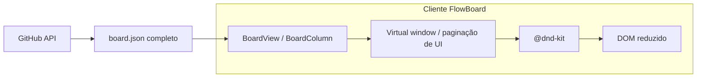
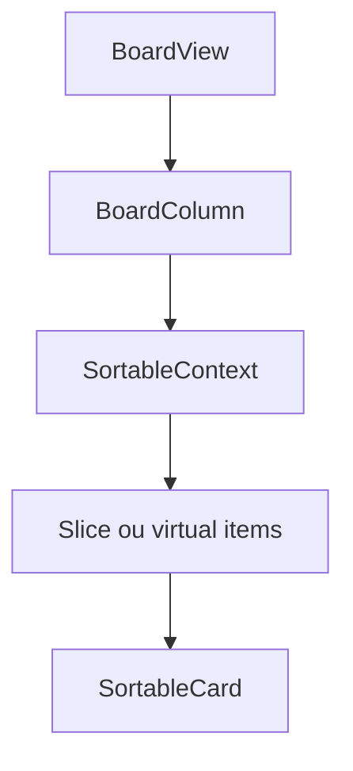
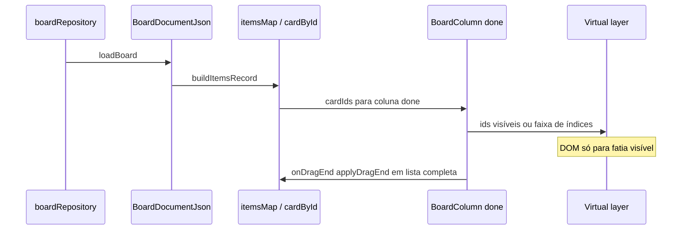

# Architecture Review Document — Coluna Concluído e performance

**Feature slug:** `done-column-performance`  
**Versão ARD:** 1.0  
**Data:** 2026-04-20  
**Score de confiança (exploração):** 88/100

---

## 1. Sumário executivo

Hoje **todos os cards** da coluna com `column.role === 'done'` são montados no DOM em `BoardColumn`, com `SortableContext` envolvendo a lista inteira (`BoardView.tsx`). Com muitos itens concluídos, o custo cresce com o número de nós React + sensores do `@dnd-kit`, afetando performance percebida.

A **persistência continua sendo o JSON completo no GitHub** (ADR-002); não existe paginação de servidor. O problema é **apresentação no cliente**: reduzir trabalho de render e de registro de sortables sem violar a Constitution (domínio puro, sem novo backend).

**Recomendação:** adotar **virtualização da lista** na coluna Concluído (biblioteca de virtualização madura + integração explícita com `@dnd-kit`), com **fallback documentado** para “Carregar mais” se a integração com DnD bloquear entrega.

---

## 2. Contexto e restrições

| Fonte | Restrição |
|--------|------------|
| Constitution II | Dados de domínio só via GitHub API no MVP; sem backend de dados próprio. |
| ADR-002 | Layout JSON do repositório; ordem dos cards nas colunas é parte do documento. |
| ADR-003 | Regras de negócio no `domain/`; UI orquestra. |
| Código atual | `buildItemsRecord` / `applyDragEnd` operam sobre listas completas de ids em memória. |

**Implicação:** qualquer “paginação” é **janela de UI** sobre o mesmo array em memória, não nova fonte de dados.

---

## 3. Padrão arquitetural detectado

- **Modular por feature:** `features/board/BoardView.tsx` orquestra DnD e persistência.
- **Domínio puro:** `domain/boardLayout.ts` define ordem e `applyDragEnd` sem React.
- **Sem biblioteca de virtualização** no `package.json` atual — decisão nova com dependência.

---

## 4. Diagramas

### 4.1 Visão de sistema (limite de responsabilidades)



### 4.2 Componentes afetados



### 4.3 Fluxo de dados (leitura e DnD)



---

## 5. Análise de trade-offs

Apenas alternativas plausíveis no contexto SPA + JSON completo + DnD.

| Opção | Ideia | Prós | Contras |
|--------|--------|------|---------|
| **A — Virtualização** | Renderizar só itens na viewport (ex.: `@tanstack/react-virtual`). | Melhor escalabilidade de DOM; scroll natural; alinhado a “performance de app”. | Integração com `@dnd-kit` é mais trabalhosa; exige testes de arraste e de borda (viewport). |
| **B — “Carregar mais” (janela crescente)** | Estado `visibleCount`; botão ou interseção incrementa N. | Implementação simples; pouca dependência nova; DnD continua com lista “real” menor mas ainda contígua. | Altura da coluna e handles de scroll mudam ao carregar; para N muito grande ainda pode pesar se o usuário carregar tudo. |
| **C — Paginação por páginas (1, 2, 3…)** | Troca de página desloca o subconjunto renderizado. | Previsível para listas enormes. | UX ruim para coluna Kanban com scroll vertical; reordenação intra-coluna confusa; combina mal com DnD. |
| **D — Apenas memo/React.memo** | Otimizar sem mudar quantidade de nós. | Baixo risco. | **Não resolve** o problema fundamental (número de nós e sortables). |

**Critério de escolha:** maximizar redução de trabalho de render **sem** alterar modelo de dados **e** manter arrastar soltar utilizável.

**Decisão recomendada:** **A (virtualização)** como alvo de implementação; **B** como plano B aceitável se o time precisar entregar mais rápido ou se a integração DnD+virtual bloquear.

**Opções descartadas:** **C** para UX de quadro; **D** como solução única.

---

## 6. ADRs

| ADR | Relação |
|-----|---------|
| ADR-006 (novo) | Registra a escolha de estratégia de janela de UI na coluna Concluído. |
| ADR-002, ADR-003 | Mantidos; sem conflito — apresentação apenas. |

---

## 7. Guardrails para o planner / implementer

- **G-DC-01:** Não introduzir camada de “página” no JSON nem no `boardRepository`; a ordem canônica continua sendo a lista completa de ids por coluna.
- **G-DC-02:** `applyDragEnd` e funções em `domain/boardLayout.ts` devem continuar a receber o **mapa completo** de itens; qualquer fatia é só entrada de **render**, não fonte de verdade.
- **G-DC-03:** Colunas que não sejam `role === 'done'` ficam fora do escopo inicial salvo decisão explícita no IPD.
- **G-DC-04:** Se usar virtualização, documentar limites conhecidos do DnD (ex.: arrastar entre viewport e overlay) e cobrir com teste manual ou E2E mínimo.
- **G-DC-05:** Contagem exibida no cabeçalho da coluna (`cardIds.length`) deve refletir o **total** no documento, não só a fatia visível.

---

## 8. Próximo passo na pipeline

1. **Planner (IPD):** definir biblioteca (ex. TanStack Virtual), tamanho estimado de integração em `BoardColumn`, critério de “aceitável” (ex. N cards de teste), e se o MVP usa A ou B.
2. **Implementer:** isolar lógica de “ids visíveis” ou wrapper de coluna `done` para não espalhar condicionais pelo restante do board.

---

## Metadata (orquestrador)

```json
{
  "agent": "architect",
  "status": "success",
  "confidence_score": 88,
  "ard_path": ".memory-bank/specs/done-column-performance/architect-FEATURE.md",
  "adrs_created": ["006-flowboard-done-column-ui-windowing.md"],
  "adrs_referenced": ["001-flowboard-spa-github-persistence.md", "002-flowboard-json-repository-layout.md", "003-flowboard-domain-and-ui-architecture.md"],
  "pattern_selected": "UI windowing over in-memory full document",
  "complexity": "M",
  "guardrails_count": 5
}
```
