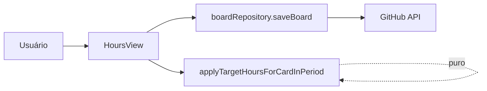
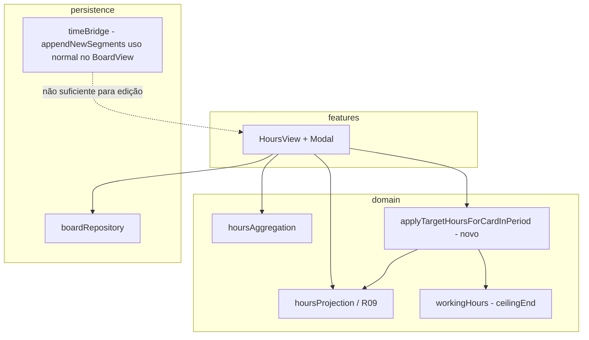
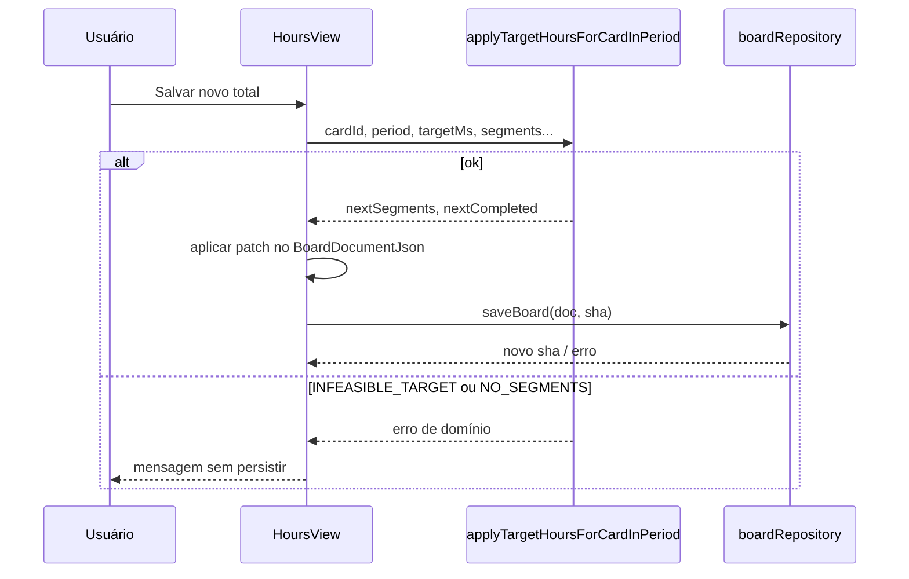

# ARD — Editar horas de apontamento (`edit-horas-apontamento`)

| Campo | Valor |
|--------|--------|
| Versão | v1.0 |
| Data | 2026-04-22 |
| TSD base | `spec-feature.md` |
| Revisor (M1) | `spec-reviewer-feature.md` (AMARELO) |
| Score de confiança | **88 / 100** |

---

## 1. Contexto

### 1.1 Resumo

A vista **Horas no período** (`HoursView`) agrega durações de `BoardDocumentJson.timeSegments` cuja inclusão no período segue **R09** (`endMs` ∈ período), alinhada a `segmentsCompletedInPeriod` em `hoursProjection.ts`. A feature adiciona edição do total da linha `(boardId, cardId)` via modal, com persistência GitHub e **sincronia obrigatória** entre `timeSegments` e `cardTimeState[cardId].completed` (RNB-02 do TSD).

### 1.2 Domínios impactados

| Área | Evidência no código | Impacto |
|------|---------------------|---------|
| Relatório / agregação | `hoursAggregation.ts`, `hoursProjection.ts` | Invariante: pós-save, `aggregateTaskHoursForPeriod` deve refletir o alvo (± arredondamento ms documentado). |
| Tempo / quadro | `timeEngine.ts`, `workingHours.ts` | Segmentos persistidos são **pedaços já materializados** (dia civil + janela de expediente) via `materializeCountableIntervals`. |
| Persistência JSON | `timeBridge.ts` (`appendNewSegments`) | Fluxo atual só **acrescenta** `timeSegments` quando `completed` cresce; **edição não pode depender só de `appendNewSegments`** — exige substituição controlada de linhas + espelho em `completed`. |
| UI | `features/hours/HoursView.tsx` | Modal, `saveBoard` + SHA, recarga da lista. |

### 1.3 Restrições arquiteturais

| ID | Restrição |
|----|------------|
| RA-01 | **Constitution I** — transformação e validação em função(ões) puras em `domain/`, sem regra de negócio só na UI. |
| RA-02 | **Constitution II** — persistência apenas via cliente GitHub existente (`boardRepository`). |
| RA-03 | **ADR-003** — fronteira `domain` ↔ `features` mantida; UI orquestra, domínio decide. |
| RA-04 | **R09** — não alterar o critério de inclusão na agregação (`endMs` no período). |
| RA-05 | **Sem mudança de schema** nesta decisão — sem novos campos em JSON; sincronia por reescrita de intervalos existentes e `segmentId` estável onde aplicável. |

---

## 2. Padrão e decisão arquitetural

### 2.1 Padrão selecionado

**Domínio puro + comando de mutação explícito no documento** (função testável que recebe snapshot mutável ou retorna clone), consumido pela feature Horas antes de `saveBoard`.

**Justificativa:** `apps/flowboard/src/domain` não importa `infrastructure` (grep limpo). O planner deve expor um contrato de entrada/saída que não acople o domínio ao módulo de persistência: ou tipo mínimo espelhado no domínio, ou o mesmo shape importado apenas na **borda** (`features` monta o input e aplica o patch no `BoardDocumentJson`). Preferência: **função pura** que recebe estrutura serializável mínima (`segments` + `completed` + `workingHours` + ids) e devolve substitutos; a feature aplica no doc completo.

### 2.2 Alternativas consideradas (M1)

| Alternativa | Desfecho |
|-------------|----------|
| **A — Redistribuição proporcional com `startMs` fixo e `endMs` livre** (preferência do TSD §6) | **Base aprovada**, desde que submetida às **restrições de viabilidade** abaixo (expediente + fim de dia). |
| **B — Re-materializar com `materializeCountableIntervals(start, novoEnd, wh)`** após alterar um único `end` global | Descartada como **algoritmo único**: reescreve o histórico como se fosse novo fluxo de trabalho; diverge da intenção de “ajustar totais da linha” sem reinterpretar o relógio. Pode ser **sub-passo interno opcional** só se A for inviável e produto aceitar “recalcular trilha” (fora do MVP atual). |
| **C — Um único segmento sintético** cobrindo o alvo | Descartada: quebra a forma já persistida (múltiplos pedaços/dias), complica R09 e difere do modelo atual de `appendNewSegments`. |

---

## 3. Decisão M1 — proporcional × expediente × meia-noite

### 3.1 Veredicto explícito (resposta ao gate)

**Redistribuição proporcional:** **aprovada com restrições** (*approved with constraints*).

Não é rejeitada: o repositório já armazena segmentos **dentro** de limites de dia civil e expediente (`workingHours.ts` + `hoursProjection.splitWallIntervalByLocalDays`). O risco levantado no TSD é real **só quando o alvo aumenta** o suficiente para que `startMs + novaDuração` ultrapasse o **teto** do mesmo pedaço (fim do dia local ou fim da janela de expediente daquele dia).

### 3.2 Regras testáveis (restrições)

1. **Seleção (Passo 1 do TSD):** conjunto afetado = `{ s ∈ doc.timeSegments | s.cardId = cardId ∧ R09(s, period) }`, com R09 idêntico a `segmentsCompletedInPeriod` (inclusivo nos extremos de `PeriodRange`).

2. **Cálculo proporcional:** seja `S = Σ (endMs - startMs)` dos selecionados. Se `S = 0` → resultado **`NO_SEGMENTS`** (E1). Caso contrário, alvo `T` em ms inteiro (derivado das horas decimais com política de arredondamento única no IPD). Para cada segmento `i` com duração `d_i`, `d'_i = round(T * d_i / S)` com **correção de resto** determinística (ex.: maior resto) para garantir **`Σ d'_i = T` exatamente**.

3. **Preservação de `startMs`:** para cada segmento, `newEndMs_i = startMs_i + d'_i` (não mover início).

4. **Teto por pedaço (expediente + meia-noite):** para cada `startMs_i`, calcule `ceilingEndMs_i` = último instante válido **no mesmo dia civil** que o pedaço original e, se `workingHours.enabled`, dentro de `[wStart, wEndEx - 1]` daquele dia (mesma semântica de `clipIntervalToWorkingHours` / `materializeCountableIntervals`). **Obrigatório:** `newEndMs_i ≤ ceilingEndMs_i` e `newEndMs_i > startMs_i` (ou política de duração mínima positiva definida no IPD, ex. 1 ms, se produto aceitar).

5. **Viabilidade global:** se existir `i` tal que `startMs_i + d'_i > ceilingEndMs_i`, a transformação retorna **`INFEASIBLE_TARGET`** (não persistir; UI exibe mensagem acionável). Não é responsabilidade do domínio “empurrar” horas para outros dias neste MVP.

6. **Alvo zero:** remover do `timeSegments` todos os registros selecionados (por `segmentId`) e remover de `cardTimeState[cardId].completed` os intervalos `[startMs, endMs]` correspondentes (match exato pré-mutação); se após remoção o card não tiver `activeStartMs` nem `completed`, entrada em `cardTimeState` pode ser omitida ou mantida vazia conforme padrão atual do repo.

7. **Sincronia `timeSegments` ↔ `completed`:** após mutação, para o `cardId` editado, o multiset de intervalos em `completed` deve coincidir com o multiset derivado de `timeSegments` daquele card (recomendação de implementação: após atualizar linhas em `timeSegments`, **reconstruir** `cardTimeState[cardId].completed` = ordenar por `startMs` os intervalos `{startMs, endMs}` de todos os `timeSegments` daquele card, para evitar drift por ordem ou duplicatas legadas). Documentar no IPD se a reconstrução total do card for preferida à atualização por par.

8. **`appendNewSegments`:** não usar como único mecanismo de escrita na edição; aplicar substituição/remoção explícita em `timeSegments` + atualização de `cardTimeState` conforme regra 7.

### 3.3 Redução de alvo (scale-down)

Quando `T < S`, a regra 4 tende a ser satisfeita automaticamente (encurtamento mantém-se dentro do envelope original). Testes de domínio devem cobrir múltiplos segmentos no período e arredondamento.

---

## 4. Invariantes (pós-condições)

| ID | Invariante |
|----|------------|
| INV-01 | Para o par `(boardId, cardId)` e `period` usados no save, a soma das durações dos segmentos elegíveis por R09 = `T` (± 0 após política de ms inteiro). |
| INV-02 | Não existe par `(segmentId)` removido de `timeSegments` que permaneça em `completed` com o mesmo intervalo; nem segmento em `timeSegments` para o card sem reflexo na lista reconstruída de `completed` (consistência card-level). |
| INV-03 | Todo `timeSegment` continua satisfazendo `endMs > startMs` e permanece **contido no mesmo dia civil** que o original daquele `segmentId` após a edição proporcional viável (consequência das regras 3–4). |
| INV-04 | Nenhuma regra P01–R14 existente é implementada apenas na UI; testes Vitest no `domain/` cobrem a função de transformação. |

---

## 5. Esboço de interface (nível assinatura)

Local sugerido: `apps/flowboard/src/domain/` (nome final no IPD).

```typescript
import type { PeriodRange } from './hoursProjection'
import type { BoardWorkingHours, CompletedSegment } from './types'

/** Registro alinhado a uma linha persistida em timeSegments (domínio não depende de infrastructure). */
export type BoardTimeSegment = {
  segmentId: string
  cardId: string
  startMs: number
  endMs: number
}

export type ApplyTargetHoursForPeriodResult =
  | { ok: true; nextSegments: BoardTimeSegment[]; nextCompleted: CompletedSegment[] }
  | { ok: false; code: 'NO_SEGMENTS' | 'INFEASIBLE_TARGET' | 'INVALID_TARGET'; detail?: string }

/**
 * Calcula o próximo par (segments do card, completed do card) após ajustar o total R09 no período.
 * Não persiste; não fala com GitHub.
 */
export function applyTargetHoursForCardInPeriod(input: {
  cardId: string
  period: PeriodRange
  /** Soma das durações dos segmentos cujo endMs ∈ period deve tornar-se targetMs (após arredondamento). */
  targetMs: number
  cardSegments: BoardTimeSegment[]
  cardCompleted: CompletedSegment[]
  workingHours?: BoardWorkingHours | null
}): ApplyTargetHoursForPeriodResult
```

A camada `HoursView` (ou helper em `features/hours/`) mapeia `BoardDocumentJson` → `cardSegments`, chama a função, aplica `nextSegments` / `nextCompleted` no documento e chama `saveBoard`.

---

## 6. Diagramas

### 6.1 Visão de sistema (contexto)



### 6.2 Componentes



### 6.3 Fluxo (save feliz)



---

## 7. ADR transversal

**Não** foi criado ADR novo em `.memory-bank/adrs/`.

**Motivo:** a decisão fecha lacuna **local** ao contrato da feature (transformação + limites de expediente), sem alterar persistência além do JSON já definido (ADR-002), nem o modelo de camadas (ADR-003). Reavaliar ADR se no IPD surgir **campo novo** no JSON (`editedAt`, etc.) ou mudança de significado global de `timeSegments`.

**ADRs referenciados:** ADR-002 (layout JSON), ADR-003 (domínio puro + features).

---

## 8. Guardrails para o planner / implementer

| ID | Guardrail |
|----|-----------|
| GA-01 | Implementar `applyTargetHoursForCardInPeriod` (ou nome IPD) **somente** em `domain/`, com testes Vitest cobrindo regras §3.2 (incl. zero, multi-segmento, resto de arredondamento, `INFEASIBLE_TARGET`). |
| GA-02 | Não usar `appendNewSegments` como único caminho para refletir edição; substituir/remover `timeSegments` por `segmentId` e sincronizar `completed` (regra 7). |
| GA-03 | Mensagens de erro de domínio mapeadas na UI (PT-BR), sem persistir em caso de falha de validação. |
| GA-04 | Manter R09 e funções existentes de período; não alterar `aggregateTaskHoursForPeriod` sem ADR/spec. |

---

## 9. Metadados (agente)

```json
{
  "agent": "architect",
  "status": "success",
  "confidence_score": 88,
  "ard_path": ".memory-bank/specs/edit-horas-apontamento/architect-feature.md",
  "adrs_created": [],
  "adrs_referenced": ["ADR-002", "ADR-003"],
  "pattern_selected": "Domain pure function + feature-side patch + GitHub persistence",
  "complexity": "S",
  "guardrails_count": 4,
  "proportional_redistribution_verdict": "approved_with_constraints"
}
```
