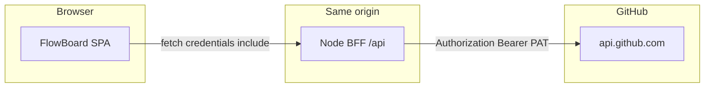

# ARD — BFF + cookie cifrado (FlowBoard)

**Slug:** `github-pat-bff-cookie-auth`  
**Data:** 2026-04-23

---

## 1. Contexto

O TSD (`spec-feature.md`) define validação de PAT no servidor, sessão cifrada em cookie httpOnly e proxy same-origin para a API GitHub. Este documento fixa **decisões arquiteturais** e trade-offs para o IPD.

---

## 2. Diagrama (C4 leve)

**Regra:** o browser **nunca** chama `api.github.com` com credencial após migração completa.

---

## 3. Decisões

| ID | Decisão | Alternativa rejeitada | Justificativa |
|----|---------|------------------------|---------------|
| D1 | BFF no **mesmo processo** que serve `dist` em produção | Dois serviços + CORS | Cookies sem cross-site; simplicidade operacional |
| D2 | Sessão **stateless cifrada no cookie** (JWE/iron) | Sessão server-side com Redis | RF02 pede cookie com PAT+metadados; stateless evita store dedicado no MVP; monitorar tamanho do cookie (ver spec-reviewer) |
| D3 | **Vite `configureServer`** para `/api` em dev; **script `node server.mjs`** em prod | Só `vite preview` | `preview` não adequado como servidor de BFF; documentar script único |
| D4 | **409** em `POST /login` com sessão ativa | Sobrescrever silenciosamente | Requisito de produto explícito |
| D5 | Atualizar **ADR-004** (substituir modelo browser-storage) | ADR isolado | Constitution III: uma fonte de verdade para PAT |

---

## 4. ADR candidato (resumo — arquivo final em `.memory-bank/adrs/`)

- Título sugerido: `005` ou evolução de `004` com status *Supersedes* claro em ADR-004.
- Conteúdo: cookie httpOnly, algoritmo de cifra, env vars, o que a SPA ainda guarda (idealmente: nada de segredo; preferências de UI seletivas em localStorage sem PAT).

---

## 5. Riscos residuais

- **BFF = novo plano de ataque (SSRF, path traversal no proxy):** validar `owner`/`repo` da sessão contra paths pedidos; não aceitar `apiBase` do cliente pós-login.
- **DDoS no login:** fora de escopo; rate limit pode ser fase 2.

---

*Próximo: `planner` → IPD com mapa de alterações e fechamento dos gaps do `spec-reviewer`.*
