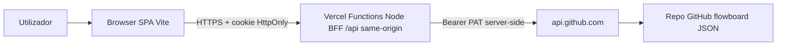
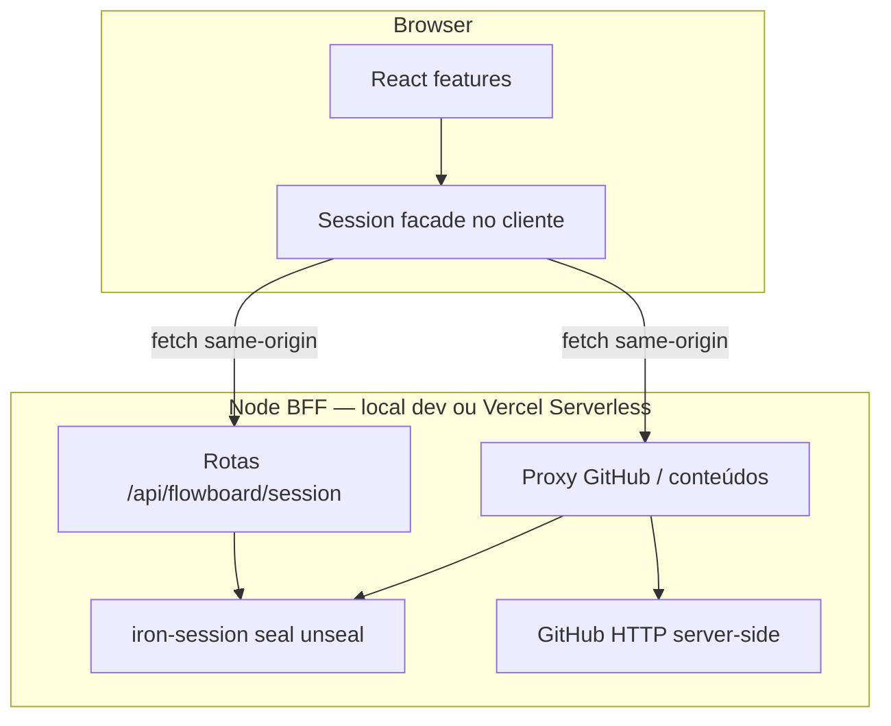
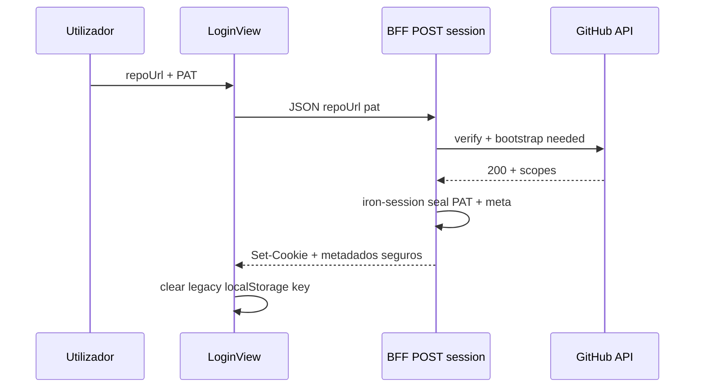

# Architecture Review Document — Proteção do PAT (BFF + sessão cifrada)

> Versão: v1.1 | Feature: `github-pat-bff-security` | Baseado em: `.memory-bank/specs/github-pat-bff-security/spec-feature.md`  
> **v1.1:** alojamento **Vercel** — BFF como **Serverless Functions (Node.js)**, não processo *always-on*; G-009-6.

---

## 1. Contexto

### 1.1 Resumo da Feature

Substituir o modelo em que o **PAT** vive no **browser** (`localStorage` / `flowboard.session.v1`) por um modelo em que o PAT **só existe** no **servidor** (memória de requisição + cookie **HttpOnly** com carga **AEAD** via `iron-session` ou equivalente), e em que **toda** chamada autenticada à **GitHub REST API** passa por **endpoints same-origin** (BFF). A SPA continua em **Vite + React**; **não** é obrigatório migrar para Next.js.

### 1.2 Domínios Impactados

- **Autenticação / sessão:** `sessionStore`, `LoginView`, fluxo de logout — deixam de persistir `pat` em Web Storage após transição.
- **Infraestrutura GitHub:** `GitHubContentsClient`, `fromSession`, `boardRepository` — o *client* deixa de ser o único caminho; surge adaptador **HTTP** para o BFF ou extensão do cliente para *base URL* interna.
- **App shell:** `App.tsx` (carga de sessão), features que instanciam cliente a partir da sessão (`BoardView`, `SearchModal`, etc.).
- **Deploy / DX:** *local* — processo Node (BFF) + *proxy* Vite; **produção — Vercel:** ficheiros estáticos do Vite + funções em `/api` com **Node.js runtime** (ver §5 e ADR-009 *Plataforma de alojamento*); `SESSION_SECRET` nas env vars do projeto.
- **Testes:** Vitest (mocks), Playwright (login / `storageState`).

### 1.3 Restrições Arquiteturais

| ID | Restrição |
|----|-----------|
| RA-01 | Constitution III: mudança de PAT/sessão documentada em ADR — **ADR-009**. |
| RA-02 | Dados de domínio continuam **só** no repo GitHub do utilizador (ADR-001); BFF **não** é base de dados de produto. |
| RA-03 | `api.github.com` e host `github.com` — allowlists existentes permanecem salvo novo ADR. |
| RA-04 | Segredo de selagem nunca em bundle cliente nem prefixo público de env. |
| RA-05 | **Alojamento alvo: Vercel** — o BFF tem de funcionar como **Serverless Functions** (Node), com *same-origin* relativo à SPA; **Edge Runtime** *não* é o alvo para handlers com `iron-session` (G-009-6). |

---

## 2. Padrão Arquitetural Selecionado

### 2.1 Decisão

**Padrão adotado:** **Backend-for-Frontend (BFF)** com **sessão stateless cifrada em cookie** (*iron-session*) e **proxy** das operações GitHub necessárias à aplicação.

**Justificativa:** Alinha o repositório **Vite** ao guia normativo (cookie HttpOnly, sem PAT em Web Storage, validação no servidor) **sem** migração de framework. `iron-session` é referência madura no ecossistema Node e encaixa em *seal/unseal* com o mesmo modelo mental do guia (AEAD).

**Alojamento (Vercel):** Não se assume um **único processo Node** a servir ficheiros estáticos e API *em produção* (padrão típico *self-hosted*). Na **Vercel**, a API é invocada **por pedido** (*serverless*), o que implica: *cold start* possível, limites de duração/payload por plano, e *runtime* **Node.js** explícito para os handlers de sessão. O *desenho* (um núcleo de lógica partilhado) deve permitir empaquetar o mesmo código em (a) *dev* local com Hono/Express e (b) *produção* com *entrypoints* `api/*.ts` ou equivalente Vercel.

**Alternativas descartadas:**

| Alternativa | Motivo |
|-------------|--------|
| Migração para Next.js App Router | Custo e escopo; TSD §8 FE05. |
| OAuth GitHub App | Fora de escopo imediato do TSD. |
| Redis/session DB | Complexidade operacional desnecessária para o primeiro corte. |

### 2.2 Consistência com o repositório

- **Dominante hoje:** SPA + domínio isolado + `GitHubContentsClient` no browser.
- **Esta feature:** **Diverge** no *trust boundary* do PAT (servidor), **mantém** domínio puro e contratos de dados JSON; **refatora** a *infrastructure* de acesso GitHub para um *facade* que, no browser, chama `/api/flowboard/...` com `credentials: 'include'`.

---

## 3. Diagramas

### 3.1 Visão de sistema (Context)



### 3.2 Componentes (Container lógico)



### 3.3 Sequência — login (happy path)



---

## 4. Architecture Decision Records (ADRs)

### ADRs criados / atualizados nesta feature

| Arquivo | Decisão | Impacto na implementação |
|---------|---------|---------------------------|
| `.memory-bank/adrs/009-flowboard-bff-pat-session.md` | BFF + `iron-session` + PAT só no servidor | IPD deve listar rotas, env, e divisão cliente/servidor |
| `.memory-bank/adrs/001-flowboard-spa-github-persistence.md` | *Atualização* 2026-04-25 | BFF não viola “dados só no GitHub” |
| `.memory-bank/adrs/004-flowboard-session-and-pat-storage.md` | *Partial supersede* Web Storage para PAT | Implementação nova segue G-009-* |

### ADRs preexistentes relevantes

| Arquivo | Guardrail ativo |
|---------|-----------------|
| ADR-002 / 005 | Layout JSON, concorrência — inalterados na essência |
| ADR-003 | Domínio puro — regras não dependem de onde o HTTP roda |

---

## 5. Stack Tecnológica

| Componente | Tecnologia | Nota |
|------------|------------|------|
| SPA | React 19 + Vite 8 | Inalterado |
| BFF *dev* | Node **20+** (LTS), framework **HTTP mínimo** (Hono/Express) | Um processo local com *proxy* Vite |
| BFF *prod (Vercel)* | **Serverless Functions** com **@vercel/node** / runtime `nodejs` | *Handlers* `api/*` ou `vercel.json` + **não** Edge para `iron-session` |
| Sessão | **iron-session** | Cookie AEAD; dependência no código partilhado de API |
| Validação body login | **Zod** (recomendado) ou equivalente | Alinhado ao guia (server-side validation) |
| Testes | Vitest + Playwright | Ajustar E2E; Preview Deploy na Vercel opcional |
| Dev | `vite` **proxy** `/api` → `localhost:PORT_BFF` | Paridade de URL com produção |
| *Deploy* | **Vercel** (estático + funções) | `vercel.json` (*rewrites*, *builds*), Root Directory, env vars |

---

## 6. Riscos e Guardrails

### 6.1 Riscos

| ID | Risco | P | I | Mitigação |
|----|-------|---|---|-----------|
| R-01 | *Cold start* ou *double port* em dev | M | M | Script `dev` único (concurrently) no IPD |
| R-02 | Cookie não enviado (SameSite / path) | M | A | Testes E2E + config explícita |
| R-03 | Fuga de PAT em log | B | A | Política de log redigido; review em code-reviewer |
| R-04 | *Timeout* Vercel vs chamadas longas à API GitHub | M | M | `maxDuration` se disponível; operações faseadas; monitorizar no Preview |
| R-05 | *Cold start* em *serverless* | M | B | *Keep-alive* irrelevante no cliente; aceitar; reduzir import pesado no caminho a quente |

### 6.2 Guardrails para o impl-planner

- **GA-01:** PAT **nunca** em props React serializáveis ao cliente após login concluído.
- **GA-02:** Todo `fetch` da SPA à GitHub **com** `Authorization` **remove-se** ou fica atrás de *feature flag* até fim da migração — o IPD define *strangler*.
- **GA-03:** Módulos server-only (BFF) em diretório/pacote separado ou marcar com convenção que o Vite **não** importa em UI.
- **GA-04:** `SESSION_SECRET` obrigatório em produção; falha de arranque se ausente ou curto.
- **GA-05:** Manter DTOs: respostas JSON do BFF **sem** ecoar cabeçalhos ou corpos completos da API GitHub quando não necessário.
- **GA-06 (Vercel):** Garantir que os *handlers* com sessão usam **Node.js** no *deploy*; *preview* e *production* com `SESSION_SECRET` definido.

---

## 7. Handoff para o impl-planner

```
[HANDOFF ARCHITECT → PLANO]
TSD: .memory-bank/specs/github-pat-bff-security/spec-feature.md
ARD: .memory-bank/specs/github-pat-bff-security/architect-feature.md
ADR-009: .memory-bank/adrs/009-flowboard-bff-pat-session.md

Feature: Proteção do PAT (BFF + sessão cifrada)

Padrão: BFF same-origin + iron-session (cookie HttpOnly) + proxy GitHub

Estrutura sugerida (ajustar nomes no IPD):
  apps/flowboard/
    api/                    # Vercel: handlers (Node) — importam o *core* abaixo
    vercel.json             # rewrites SPA + rotas /api; Root Directory no painel Vercel
    server/                 # núcleo partilhado + arranque local *dev*
      index.ts              # bootstrap HTTP só para desenvolvimento
      routes/session.ts
      routes/githubProxy.ts
      session/ironOptions.ts
    src/
      infrastructure/
        session/sessionStore.ts   # sem pat no tipo persistido
        github/
          bffClient.ts            # NOVO: fetch /api/flowboard/...
          client.ts               # usado só server-side OU legado durante migração

Componentes a criar:
  - Rotas BFF: estabelecer sessão, logout, proxy (Contents API subset usado por boardRepository/attachments)
  - Cliente browser: *facade* que substitui createClientFromSession para chamadas via BFF
  - Migração: limpar / ignorar chave localStorage legada; fluxo re-login

Fluxo principal: LoginView → POST /api/flowboard/session → Set-Cookie → UI usa fetch com credentials → BFF unseal → GitHub

Guardrails: GA-01 a GA-06 (§6.2) + G-009-1 a G-009-6 (ADR-009)

Fora de escopo: OAuth, Next.js, dados fora do GitHub do user
```

---

## Metadados

| Campo | Valor |
|-------|--------|
| Gerado por | architect (orquestrador; subagente indisponível) |
| TSD de origem | `.memory-bank/specs/github-pat-bff-security/spec-feature.md` |
| Data | 2026-04-25 |
| Confiança | 80/100 |
| Complexidade | L |
