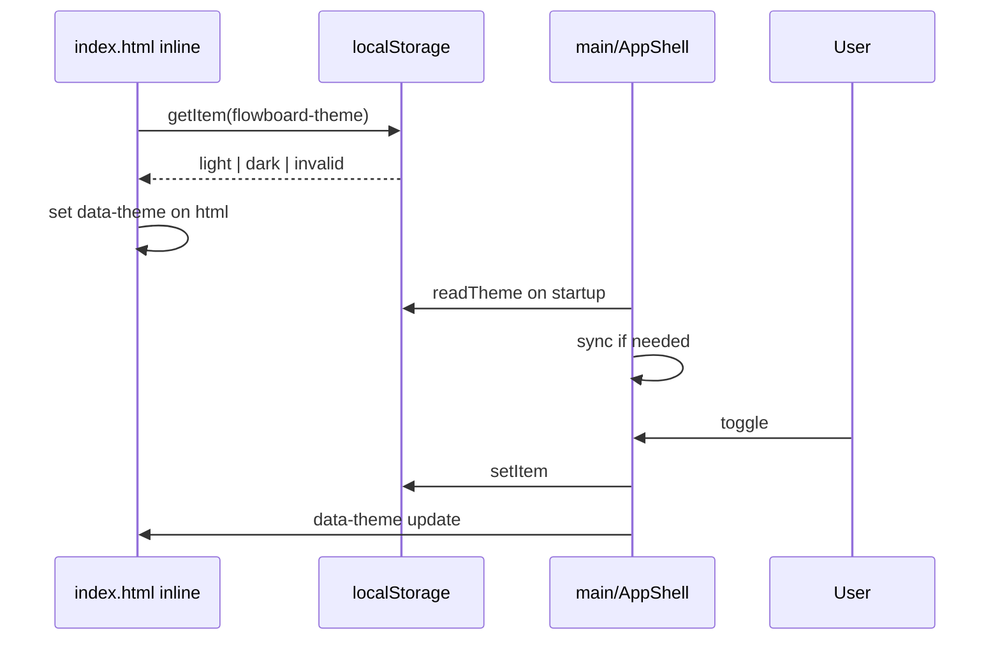

# Plano de implementação (IPD): Tema light/dark com localStorage

**Versão:** v1.0  
**Data:** 2026-04-22  
**Slug:** light-dark-theme  
**Track:** FEATURE

---

## 1. Resumo executivo

Implementar segundo preset visual **light** espelhando tokens em `tokens.css`, controlar tema via `data-theme` em `<html>`, persistir com **`flowboard-theme`** (string `"dark"` | `"light"`), bootstrap síncrono em `index.html` para FOUC, toggle na topbar do `AppShell`, testes Vitest no store, alinhar `SearchModal.css` (remover media query inconsistente).

---

## 2. Mapa de alterações (ordem sugerida)

| # | Arquivo / caminho | Ação |
|---|-------------------|------|
| 1 | `apps/flowboard/src/infrastructure/theme/themeConstants.ts` | **Novo:** export `THEME_STORAGE_KEY = 'flowboard-theme'`, `type ThemeMode`, helpers `isThemeMode`. |
| 2 | `apps/flowboard/src/infrastructure/theme/themeStore.ts` | **Novo:** `readTheme()`, `writeTheme(mode)`, `applyThemeToDocument(mode)` com guards `localStorage`. |
| 3 | `apps/flowboard/src/infrastructure/theme/themeStore.test.ts` | **Novo:** invalid input → dark; round-trip; storage unavailable. |
| 4 | `apps/flowboard/index.html` | **Editar:** script inline que usa **literal** `'flowboard-theme'` + aplica `document.documentElement.dataset.theme` (comentário: manter chave alinhada a `themeConstants.ts`). |
| 5 | `apps/flowboard/src/styles/tokens.css` | **Editar:** mover/duplicar tokens dark sob `:root, [data-theme="dark"]` se necessário; adicionar bloco `[data-theme="light"] { ... }` com paleta clara coerente (fundos claros, texto escuro, bordas sutis escuras). |
| 6 | `apps/flowboard/src/main.tsx` ou `App.tsx` | **Editar:** após mount, `readTheme()` + `applyThemeToDocument` para sincronizar React com DOM já setado pelo inline script. |
| 7 | `apps/flowboard/src/features/app/AppShell.tsx` + `AppShell.css` | **Editar:** botão toggle (ícone sol/lua ou texto), chama `writeTheme` + `applyThemeToDocument`, estado inicial de `readTheme()`. |
| 8 | `apps/flowboard/src/features/app/SearchModal.css` | **Editar:** remover `@media (prefers-color-scheme: light)` placeholder; confiar nos tokens. |
| 9 | Onboarding | **Verificar:** se renderiza dentro do mesmo app, tema já aplicado; se rota isolada sem AppShell, garantir que bootstrap HTML cobre. |

---

## 3. Fluxo de execução

---

## 4. Definição de pronto (DoD)

- [ ] Dois temas utilizáveis sem depender de `prefers-color-scheme` para cor base.
- [ ] Persistência verificada por testes + verificação manual.
- [ ] Inline bootstrap presente e documentado.
- [ ] `pnpm test` / `npm test` no pacote flowboard sem falhas nos novos testes.
- [ ] Lint limpo nos arquivos tocados.

---

## 5. Estratégia de testes

- **Unit:** `themeStore.test.ts` — casos da spec R1, R3.
- **Manual:** F5, aba anônima (sem storage), toggle repetido.
- **E2E (opcional nesta entrega):** um assert de `data-theme` se a suíte Playwright já existir para shell.

---

## 6. Riscos residuais

- Duplicação chave inline vs TS: mitigada por comentário + grep na revisão.
- Cobertura incompleta de variáveis no light: revisar lista de `var(--*)` no app.
