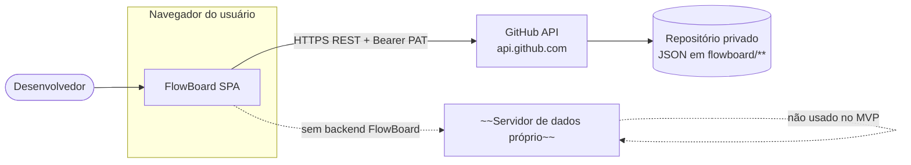
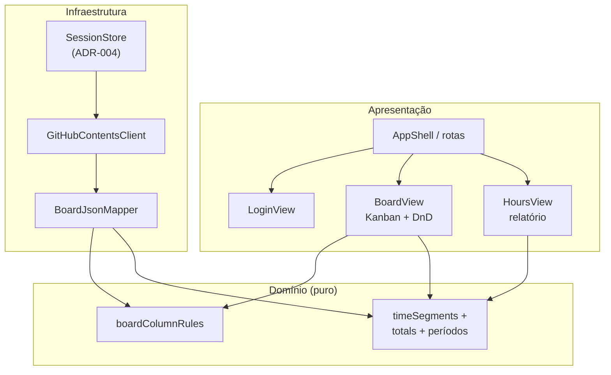
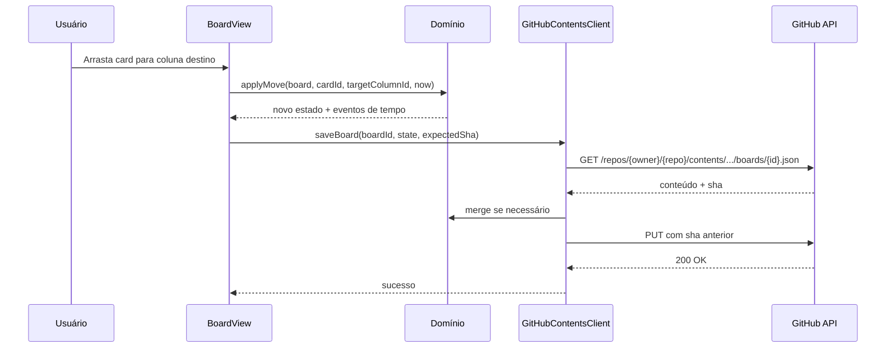
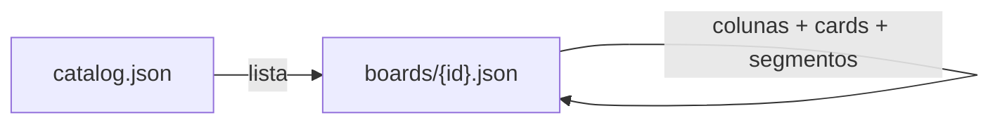

# Architecture Review Document — FlowBoard (MVP)

> **Versão:** v1.0 | **Feature / slug:** personal-kanban | **Baseado em:** `spec-epic.md` v1.0 + `spec-reviewer-epic.md`  
> **Data:** 2026-04-19 | **Autor:** architect (EPIC)  
> **Protótipo de referência:** `.memory-bank/specs/personal-kanban/prototypes/index.html`  
> **Confiança da exploração:** 78/100 — repositório **greenfield** (sem `package.json` na raiz); decisões são **propostas de bootstrap** alinhadas ao TSD e aos ADRs abaixo.

---

## 1. Contexto

### 1.1 Resumo da feature

**FlowBoard** é uma SPA desktop-first onde um desenvolvedor autentica com **URL de repositório GitHub** + **PAT**, gerencia **múltiplos quadros Kanban** com colunas de papéis fixos (Backlog / Em progresso / Concluído), **cards** e **segmentos de tempo** persistidos como **JSON** no repositório via **GitHub REST API**, com **relatório de horas** por período e escopo de quadro.

### 1.2 Domínios impactados

| Domínio / módulo | Impacto |
|------------------|---------|
| **Autenticação de sessão** | Login, validação de credenciais contra GitHub, armazenamento seguro do PAT (ADR-004) |
| **Persistência remota** | Cliente GitHub Contents + layout de arquivos (ADR-001, ADR-002, ADR-005) |
| **Domínio Kanban + tempo** | Regras P01–R14 em camada pura testável (ADR-003) |
| **UI** | Shell alinhado ao protótipo; sem features extras não cobertas pelo PRD (guardrails ADR-003) |

### 1.3 Restrições arquiteturais

| ID | Restrição |
|----|-----------|
| RA-01 | Nenhum backend próprio de dados no MVP (PRD / ADR-001) |
| RA-02 | Dados de domínio apenas em JSON no repo do usuário; PAT fora dos blobs versionados |
| RA-03 | Escritas GitHub com **SHA** atual; tratar 409/429 explicitamente (ADR-005) |
| RA-04 | Protótipo: **não** tratar busca global, notificações, favoritos ou labels como escopo MVP sem PRD (`spec-reviewer` [A4]) |

---

## 2. Padrão arquitetural selecionado

### 2.1 Decisão

**Padrão adotado:** **SPA + domínio funcional puro + adaptador de infraestrutura (GitHub)** — variante enxuta de **ports and adapters**: o núcleo de regras e o modelo de dados são independentes do React (ou framework escolhido no IPD).

**Justificativa:** O risco principal é **correção das regras de tempo e consistência com GitHub**; isolar domínio maximiza testabilidade e reduz acoplamento à API HTTP. Não há servidor intermédio, alinhado a ADR-001.

**Alternativas descartadas:**

| Alternativa | Motivo |
|-------------|--------|
| MVC clássico só em componentes | Regras espalhadas, difícil provar invariantes de coluna/segmento |
| Backend BFF | Fora do escopo de custo e de produto no MVP |
| Micro-frontends | Complexidade desnecessária para single-user |

### 2.2 Consistência com o repositório existente

- **Padrão dominante no repo:** *inexistente* para a app FlowBoard — workspace contém principalmente skills/agents; a aplicação será **novo pacote** na raiz ou em `apps/flowboard` conforme IPD.
- **Esta feature:** estabelece **precedente**; ADRs em `.memory-bank/adrs/` são a fonte de verdade para decisões globais.

---

## 3. Diagramas

### 3.1 Visão de sistema (C4 — contexto)



### 3.2 Componentes lógicos (MVP)



### 3.3 Sequência — persistir movimento de card (caminho feliz)



### 3.4 Fluxo de dados — catálogo e quadro



---

## 4. ADRs registrados

| ADR | Título |
|-----|--------|
| [ADR-001](../../adrs/001-flowboard-spa-github-persistence.md) | SPA + persistência exclusiva via GitHub API |
| [ADR-002](../../adrs/002-flowboard-json-repository-layout.md) | Layout `flowboard/catalog.json` + `flowboard/boards/<id>.json` |
| [ADR-003](../../adrs/003-flowboard-domain-and-ui-architecture.md) | Domínio puro + features + guardrails do protótipo |
| [ADR-004](../../adrs/004-flowboard-session-and-pat-storage.md) | PAT em `sessionStorage` no MVP |
| [ADR-005](../../adrs/005-flowboard-github-concurrency.md) | Concorrência otimista + SHA + retry |

---

## 5. Stack recomendada (para o planner — não bloqueante)

O TSD é agnóstico de frontend. **Proposta inicial** para o IPD (duas opções válidas):

| Camada | Opção A | Opção B |
|--------|---------|---------|
| Runtime | React 19 + TypeScript | Vue 3 + TypeScript |
| Build | Vite | Vite |
| HTTP | `fetch` encapsulado em `GitHubContentsClient` | idem |
| Testes domínio | Vitest | Vitest |
| DnD | `@dnd-kit` ou similar | nativa + acessível |

**Critério de escolha:** familiaridade do time e ecossistema de testes E2E (ex.: Playwright) já alinhado ao repositório.

---

## 6. Não objetivos arquiteturais (MVP)

- Servidor FlowBoard, fila de sync offline robusta, CRDT
- GraphQL GitHub como caminho principal (REST Contents é suficiente)
- Empacotamento Electron

---

## 7. Riscos arquiteturais e mitigação

| Risco | Mitigação |
|-------|-----------|
| XSS exfiltrando PAT | CSP estrita no IPD; dependências auditadas; ADR-004 |
| Conflito 409 frequente no mesmo quadro | Particionamento por quadro; UX de retry (ADR-005) |
| Rate limit em bursts | Debounce de escrita; fila leve opcional pós-MVP |

---

## 8. Handoff para o planner

1. **Bootstrap** do pacote app (Vite + TS) na estrutura ADR-003.  
2. Implementar **`GitHubContentsClient`** + paths ADR-002 + fluxo SHA ADR-005.  
3. Implementar **`domain`** com testes Vitest cobrindo R01–R06 e projeção de horas R09.  
4. Implementar views: **Login** (RF02), **lista/seleção de quadros** e **CRUD** RF05–RF07 (UI além do protótipo estático, `spec-reviewer` [A5]).  
5. **Matriz RF × testes** para cobrir lacunas apontadas em `spec-reviewer-epic.md` [A2].  
6. **Corte explícito** no IPD para RF12 “Todos os quadros” se esforço não marginal (TSD RF12).  
7. Documentar **ordem de escrita** catalog vs board ao criar/arquivar quadro para evitar catálogo órfão.

---

## Metadata

```json
{
  "agent": "architect",
  "status": "success",
  "confidence": 78,
  "ard_path": ".memory-bank/specs/personal-kanban/architect-epic.md",
  "adrs": [
    ".memory-bank/adrs/001-flowboard-spa-github-persistence.md",
    ".memory-bank/adrs/002-flowboard-json-repository-layout.md",
    ".memory-bank/adrs/003-flowboard-domain-and-ui-architecture.md",
    ".memory-bank/adrs/004-flowboard-session-and-pat-storage.md",
    ".memory-bank/adrs/005-flowboard-github-concurrency.md"
  ]
}
```
