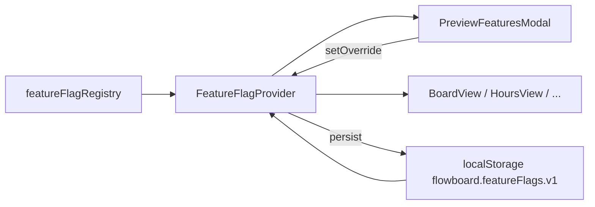

# ARD — Feature flags de preview

**Slug:** `preview-feature-flags`  
**Data:** 2026-04-26

## Decisão principal

**Registo em código + overrides em `localStorage`**, sem alteração ao modelo de dados GitHub.

## Componentes

1. **Registry (módulo puro):** lista `FeatureFlagDefinition`, helpers `listPreviewFlags`, `getFeatureFlagDefinition`.
2. **Persistence layer:** leitura/escrita JSON em `flowboard.featureFlags.v1`, padrão igual a `themeStore` (try/catch).
3. **Resolução de estado:** função pura `resolveEnabled(def, overrides)` para testes.
4. **Integração React:** `FeatureFlagProvider` + `useFeatureFlag(id)` opcional, ou hook fino que lê storage no mount e após `setState` local — evitar re-renders globais desnecessários (só consumidores do id ou provider com mapa).

## Trade-offs

| Opção | Prós | Contras |
|--------|------|---------|
| Context API | API clara, testável com wrapper | Re-renders se um único objeto mudar sem memo |
| Módulo singleton + evento custom | Leve | Menos idiomático em React 19 |
| **Recomendado:** Context + `useMemo` para valor estável + `setFlag` que merge overrides | Alinhado ao ecossistema atual | Pequeno boilerplate |

## ADR proposto (opcional)

Se o time quiser registo formal: **`.memory-bank/adrs/0xx-flowboard-client-feature-flags.md`** — “preferências de preview apenas em localStorage; registo em código; sem sync GitHub”.

## Diagrama (Mermaid)

## Gate arquitetural

Nenhum bloqueio: decisão compatível com MVP e Constitution.
