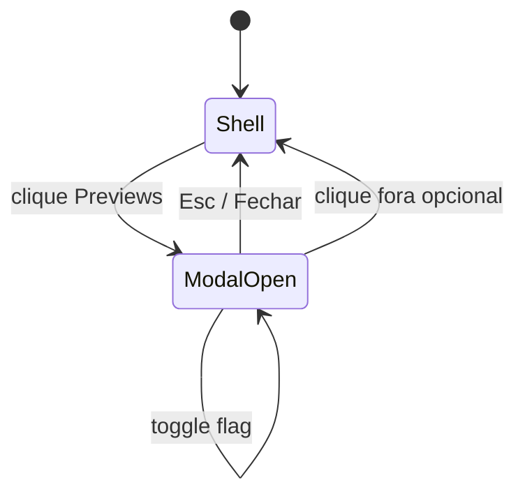

# Protótipo de UI — Previews (feature flags)

**Slug:** `preview-feature-flags`  
**Referência visual:** alinhado a `AppShell.css` / topbar existente (discreto, não competir com “Buscar” ou “Sair”).

## 1. Princípios

- **Discreto:** ícone pequeno ou label curta, estilo `fb-btn-text` / botão ghost, sem cor de destaque agressiva.
- **Previsível:** mesmo sítio em todas as vistas (Quadro / Horas / Arquivados).
- **Acessível:** nome acessível “Pré-visualizações experimentais” ou similar.

## 2. Posicionamento na topbar

Wireframe ASCII da zona `fb-topbar__actions` (da esquerda para a direita após busca):

```
[ tema ☼ ]  [ Previews ⧉ ]  [ v0.x.x ]  [ GitHub · owner/repo ]  [ Sair ]
```

- **Botão “Previews”:** classe sugerida `fb-preview-lab-btn` — tipografia menor ou opacidade ~0.85 em repouso, 1 em hover/focus.
- Ícone opcional: flask, beaker, ou “∞” minimal (SVG 16px, `currentColor`).

## 3. Modal

### Estrutura

- **Overlay:** `rgba(0,0,0,0.45)` coerente com `SearchModal` se existir padrão.
- **Painel:** largura máx. `min(420px, 92vw)`, cantos arredondados, sombra suave.
- **Cabeçalho:** título “Pré-visualizações”; botão fechar (×) com `aria-label="Fechar"`.
- **Corpo:** lista scrollável; cada item:
  - Título (semibold)
  - Descrição opcional (cor secundária, 13–14px)
  - À direita: switch nativo estilizado ou `role="switch"` + `aria-checked`

### Estado vazio

```
Não há pré-visualizações disponíveis nesta versão.
```

Texto secundário opcional: “Quando houver novidades experimentais, poderá ativá-las aqui.”

### Mermaid — fluxo



## 4. Comportamento do switch

- Mudança **imediata** na UI e persistência em `localStorage`.
- Sem botão “Guardar”.
- Feedback: se algum consumidor estiver montado, atualizar sem reload (via Context).

## 5. Esboço CSS (referência, não código final)

```css
/* excerpt concept only */
.fb-preview-lab-btn {
  font-size: 0.8125rem;
  opacity: 0.88;
  padding: 0.35rem 0.5rem;
}
.fb-preview-lab-btn:hover,
.fb-preview-lab-btn:focus-visible {
  opacity: 1;
}
.fb-preview-modal__row {
  display: flex;
  align-items: flex-start;
  justify-content: space-between;
  gap: 1rem;
  padding: 0.75rem 0;
  border-bottom: 1px solid var(--fb-border-subtle, rgba(255,255,255,0.08));
}
```

Variáveis devem mapear para tokens já usados em `AppShell.css` quando implementado.

## 6. O que não aparece

- Nenhuma linha para flags `stable`.
- Nenhuma secção “Funcionalidades lançadas” (evitar ruído; release notes continuam em `/releases`).

## 7. Mobile / narrow

- Botão mantém label curto “Labs” ou só ícone com `aria-label` completo se largura < 480px (opcional fase 2).

---

**Gate:** este ficheiro é o protótipo pós-plano; implementação só após HITL no `state.yaml`.
