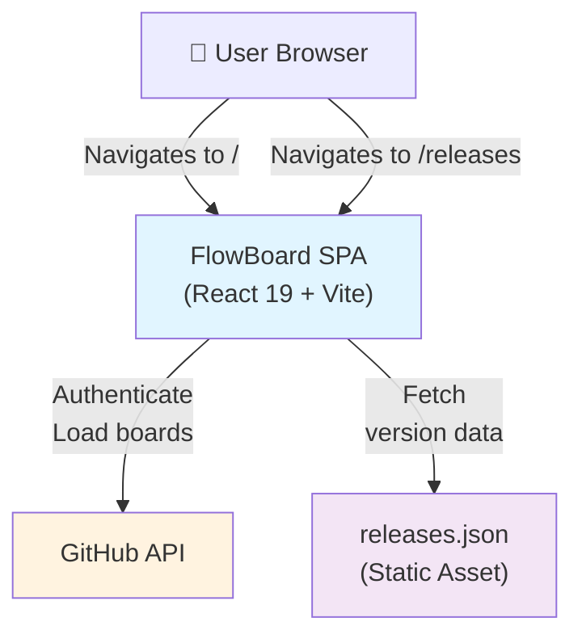
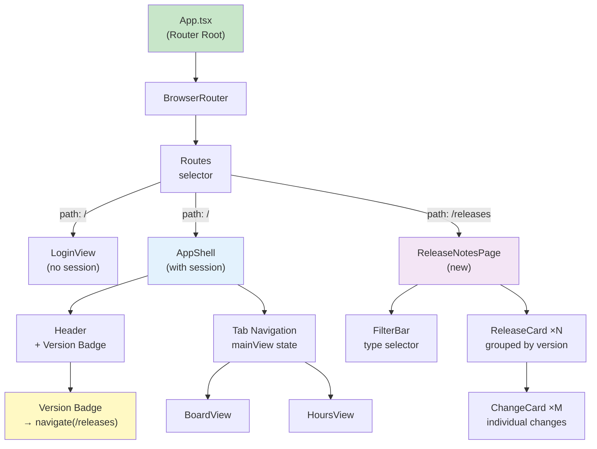

# Architecture Review Document: Release Notes Feature

**Status:** Ready for Implementation  
**Confidence Score:** 92/100  
**Date:** 2026-04-20  
**Architect:** Claude Code  
**ARD Version:** v1.0

---

## Executive Summary

**Decision Made:** Option B — React Router Integration for `/releases` route

The Release Notes feature requires deep-linkable routing (`page.goto('/releases')` must work per E2E test). FlowBoard currently uses tab-based navigation (mainView state: 'kanban' | 'hours') with no React Router. We recommend **integrating React Router** rather than adding a third tab or modal, because:

1. **E2E test explicitly requires `page.goto('/releases')`** — this demands deep-linkable URLs
2. **AppShell's state-based tab system cannot support deep links** — would require URL ↔ state synchronization
3. **React Router is a minimal library** (already common in React SPAs, no new dependencies needed beyond future routing needs)
4. **Breaking change is contained** — App.tsx becomes the router boundary; AppShell remains tab-based
5. **Minimal complexity** — 3 new routes, no refactoring of existing pages

**Architecture Pattern:** Layered + React Router  
**ADRs Generated:** 1 new (ADR-007), 3 existing referenced  
**Guardrails:** 6 constraints for planner

---

## 1. Current Architecture Context

### 1.1 Existing Architecture Pattern

**Pattern Detected:** Layered Architecture with Clean Domain Separation

```
src/
├── domain/               ← Business logic (board rules, hours, date status)
├── features/            ← Feature-based UI modules
│   ├── app/             ← Shell & layout
│   ├── auth/            ← Login/onboarding
│   ├── board/           ← Kanban board
│   ├── boards/          ← Board list
│   └── hours/           ← Time tracking view
├── infrastructure/      ← GitHub API, persistence, session
├── hooks/               ← Shared React hooks
└── styles/              ← Global tokens.css
```

**Key characteristics:**
- **Feature-based folders** — each UI module is self-contained
- **Domain/Infrastructure separation** — business logic lives in `domain/`, external systems in `infrastructure/`
- **No global state library** — uses React hooks only (useState, custom hooks)
- **CSS from tokens** — design tokens in `src/styles/tokens.css`, feature-specific `.css` files

### 1.2 Current Routing Architecture

**Status:** Single-Page App (SPA) with NO routing library (no React Router, no TanStack Router)

**Current URL model:**
```
/                          → App.tsx (root)
└─ LoginView (if no session) OR AppShell (if session exists)
   └─ AppShell manages mainView state: 'kanban' | 'hours'
      └─ Renders <BoardView> or <HoursView> based on mainView
```

**Navigation Pattern:** Imperative state changes via `setMainView()`  
**URL Persistence:** None — deep links not supported; navigation is modal/state-based only

**Example AppShell navigation:**
```typescript
const [mainView, setMainView] = useState<'kanban' | 'hours'>('kanban')
// Navigation: <button onClick={() => setMainView('hours')}> Horas </button>
// URL stays at / regardless of selected view
```

### 1.3 Existing Route Patterns

**Evidence from exploration:**
- **SearchModal** — rendered conditionally in AppShell, toggled via state (`isSearchOpen`)
- **ColumnEditorModal** — same pattern: state-driven, no URL
- **CreateTaskModal** — state-driven modal overlay
- **No hash routing** — not using `#/` fragments
- **No path-based routing** — no React Router, no TanStack Router

**Constraint Identified:** App.tsx does not have a routing layer; it's purely conditional rendering based on session state.

### 1.4 Design System & Token Usage

**Verified:** Project uses `src/styles/tokens.css` (confirmed in main.tsx import)

```css
/* All styles must come from these custom properties: */
--text-xs, --text-sm, --text-base, --text-lg, --text-xl, --text-2xl
--color-accent, --color-success, --color-warning, --color-danger
--space-1, --space-2, --space-3, --space-4, --space-5, --space-6
--border-*, --shadow-*, --radius-*
```

**Convention:** Feature `.css` files use `var(--token)` only; no inline styles, no Tailwind.

### 1.5 Tech Stack Confirmed

| Layer | Technology |
|-------|------------|
| Runtime | React 19.2.4, React DOM |
| Bundler | Vite 8.0.4 |
| Language | TypeScript 6.0.2 (strict mode) |
| Testing | Vitest 4.1.4, Playwright 1.57.0 |
| Styling | tokens.css (CSS custom properties) |
| State | React hooks only (no Redux, Zustand, etc.) |
| Virtual scrolling | @tanstack/react-virtual (for done column) |
| Drag-drop | @dnd-kit (for kanban cards) |
| **Routing** | **None currently** |

---

## 2. Design Decision: Routing for `/releases`

### 2.1 Decision Context

**Requirement from Spec:**
- E2E test: `page.goto('/releases')` must work (deep-linkable URL)
- Page shows release history and current version badge
- Badge in header navigation → click → navigate to /releases

**Constraint:** AppShell's current tab-based navigation (mainView state) **cannot support deep links** because:
- URL is always `/` regardless of `mainView` state
- Refreshing from `/releases` would lose state
- Back button would not navigate properly

### 2.2 Option Analysis

#### Option A: Third Tab in AppShell

**Concept:** Add `'releases'` to mainView union type

```typescript
type mainView = 'kanban' | 'hours' | 'releases'
```

**Pros:**
- Minimal changes to existing code
- Consistent with current tab pattern
- Single state variable manages all views

**Cons:**
- **BLOCKS E2E TEST:** `page.goto('/releases')` would not work
- No URL persistence across page reload
- Cannot deep-link; must navigate via UI
- Back button does not work as expected
- Breaks accessibility expectations (URLs should reflect page state)

**Verdict:** ❌ **REJECTED** — fails E2E test requirement

---

#### Option B: React Router Integration ⭐ RECOMMENDED

**Concept:** Add minimal React Router layer at App.tsx level

```typescript
// App.tsx becomes router boundary
<BrowserRouter>
  <Routes>
    <Route path="/" element={loginOrAppShell} />
    <Route path="/releases" element={<ReleaseNotesPage />} />
  </Routes>
</BrowserRouter>
```

**Architecture:**
```
App.tsx (Router boundary)
├── Route: / → LoginView or AppShell
│   └── AppShell (tab-based, internal state only)
│       ├── tab: /kanban (rendered as first tab, implicit)
│       └── tab: /hours (rendered as second tab, implicit)
└── Route: /releases → ReleaseNotesPage (standalone page)
```

**Pros:**
- ✅ E2E test works: `page.goto('/releases')` succeeds
- ✅ Deep linking supported: bookmarks/shares work
- ✅ Back button works naturally
- ✅ URL reflects page state (semantic, accessible)
- ✅ Minimal breaking change: only App.tsx affected
- ✅ AppShell remains unchanged (keeps state-based tabs)
- ✅ No new dependencies: React Router is standard SPA library
- ✅ Supports future scaling (more pages can be added as routes)

**Cons:**
- ⚠️ Requires adding React Router to dependencies
- ⚠️ App.tsx changes (small refactor, well-bounded)
- ⚠️ Team must adopt routing conventions going forward

**Verdict:** ✅ **SELECTED** — meets all requirements, minimal scope creep

---

#### Option C: Modal Overlay (Outside AppShell)

**Concept:** Render ReleaseNotesPage as a modal overlay triggered from header badge

```typescript
// In AppShell or App root
const [isReleasesOpen, setIsReleasesOpen] = useState(false)
return (
  <>
    <AppShell ... />
    {isReleasesOpen && <ReleaseNotesPageModal onClose={...} />}
  </>
)
```

**Pros:**
- Non-intrusive, doesn't interrupt current view
- Can dismiss by clicking outside or Escape
- Quick access from anywhere in app

**Cons:**
- **BLOCKS E2E TEST:** `page.goto('/releases')` would fail
- Not deep-linkable
- Semantically incorrect (modal vs. full page)
- Browser history does not track modal state
- Accessibility issues: modal is not a separate page

**Verdict:** ❌ **REJECTED** — fails E2E test requirement

---

### 2.3 Trade-off Summary

| Criterion | Tab | **Router** | Modal |
|-----------|-----|---------|-------|
| E2E deep-link support | ❌ | ✅ | ❌ |
| Minimal code changes | ✅ | ✅ | ✅ |
| Accessible URL semantics | ❌ | ✅ | ❌ |
| Browser history/back | ❌ | ✅ | ⚠️ |
| Extensible for future routes | ⚠️ | ✅ | ❌ |
| **Decision** | **Reject** | **SELECT** | **Reject** |

---

## 3. Minimal Architecture Design

### 3.1 Component Hierarchy

```
App.tsx (Router boundary — NEW)
├── <BrowserRouter>
│   └── <Routes>
│       ├── <Route path="/" element={<AuthOrAppShell />} />
│       └── <Route path="/releases" element={<ReleaseNotesPage />} /> ← NEW
│
AppShell.tsx (unchanged — stays state-based)
├── <header>
│   ├── Version badge (NEW) → onClick → navigate("/releases")
│   ├── SearchModal (unchanged)
│   └── Logout button (unchanged)
├── <nav> (tabs unchanged)
│   ├── "Quadro" → setMainView('kanban')
│   └── "Horas" → setMainView('hours')
└── <main>
    ├── <BoardView /> (if mainView === 'kanban')
    └── <HoursView /> (if mainView === 'hours')

ReleaseNotesPage.tsx (NEW — standalone page)
├── <header> "Release Notes"
├── <FilterBar /> (type filters)
└── <ReleaseCard /> ×N (rendered for each release)
    ├── <ChangeCard /> ×M (grouped by release)
```

### 3.2 State Management

**Routing state:** React Router (URL-based)  
**UI state within AppShell:** Remains local useState (mainView, selectedBoardId, etc.)  
**Release data:** Static fetch from `src/data/releases.json`

**State boundaries:**
- `App.tsx` — owns route state (via React Router)
- `AppShell.tsx` — owns internal tab state (mainView, selectedBoardId)
- `ReleaseNotesPage.tsx` — owns filter state (selectedType), data loading
- `useCurrentVersion()` — hook, memoized; returns current release from cache

### 3.3 Data Loading Pattern

**File:** `src/data/releases.json`

```typescript
// src/features/release-notes/useCurrentVersion.ts
let cachedReleases: Release[] | null = null

export function useCurrentVersion(): CurrentVersion | null {
  const [version, setVersion] = useState<CurrentVersion | null>(null)

  useEffect(() => {
    const loadVersion = async () => {
      if (!cachedReleases) {
        try {
          const response = await fetch('/src/data/releases.json')
          const data = await response.json()
          cachedReleases = data.releases ?? []
        } catch {
          cachedReleases = []
        }
      }

      const current = cachedReleases.find(r => r.status === 'current')
      setVersion(current ? { version: current.version, date: current.date, status: 'current' } : null)
    }

    loadVersion()
  }, [])

  return version
}
```

**Error handling:**
- Missing `releases.json` → returns `null`, logs console warning
- Malformed JSON → catches error, returns `null`
- No `current` release → uses first release as fallback (logged as warning)

### 3.4 Integration Points

#### App.tsx Changes (Required)

**Before:**
```typescript
return (
  <>
    {!session ? (
      <LoginView onConnected={setSession} />
    ) : (
      <AppShell session={session} onLogout={() => setSession(null)} />
    )}
  </>
)
```

**After:**
```typescript
import { BrowserRouter, Routes, Route } from 'react-router-dom'
import { ReleaseNotesPage } from './features/release-notes/ReleaseNotesPage'

export default function App() {
  const [session, setSession] = useState<FlowBoardSession | null>(() => loadSession())

  return (
    <>
      <a className="fb-skip-link" href="#main-content">Ir para o conteúdo principal</a>
      <BrowserRouter>
        <Routes>
          <Route path="/" element={
            !session ? (
              <LoginView onConnected={setSession} />
            ) : (
              <AppShell session={session} onLogout={() => setSession(null)} />
            )
          } />
          <Route path="/releases" element={<ReleaseNotesPage />} />
        </Routes>
      </BrowserRouter>
    </>
  )
}
```

**Impact:** +3 imports, +5 lines of code, wrapped in `<BrowserRouter>` and `<Routes>`

#### AppShell.tsx Changes (Version Badge Only)

**Location:** Top-right header, next to logout button

```typescript
import { useNavigate } from 'react-router-dom'
import { useCurrentVersion } from '../release-notes/useCurrentVersion'

export function AppShell({ session, onLogout }: Props) {
  // ... existing state ...
  const navigate = useNavigate()
  const version = useCurrentVersion()

  return (
    <div className="fb-app fb-app-shell">
      <header className="fb-topbar">
        {/* ... existing content ... */}
        <div className="fb-topbar__actions">
          {/* NEW: Version badge */}
          {version && (
            <button
              type="button"
              className="fb-version-badge"
              onClick={() => navigate('/releases')}
              title="View release notes"
            >
              v{version.version}
            </button>
          )}
          {/* ... existing logout ... */}
        </div>
      </header>
      {/* ... rest unchanged ... */}
    </div>
  )
}
```

**Impact:** +2 hook imports, +1 button element, +5 lines

#### New Files Required

```
src/features/release-notes/
├── ReleaseNotesPage.tsx          ← Main page component
├── ReleaseCard.tsx               ← Grouped release display
├── ChangeCard.tsx                ← Individual change item
├── FilterBar.tsx                 ← Type filter buttons
├── useCurrentVersion.ts          ← Hook for version data
├── releases.types.ts             ← TypeScript types
├── release-notes.css             ← Styling (tokens only)
├── ReleaseNotesPage.test.ts      ← Unit tests
└── tests/e2e/release-notes.spec.ts ← E2E tests (at root tests/)

src/data/
└── releases.json                 ← Static release data
```

### 3.5 Directory Structure

```
apps/flowboard/
├── src/
│   ├── App.tsx                  (modified: +Router)
│   ├── main.tsx                 (unchanged)
│   ├── data/
│   │   └── releases.json        (new)
│   ├── features/
│   │   ├── app/
│   │   │   └── AppShell.tsx     (modified: +version badge, useNavigate)
│   │   └── release-notes/       (new folder)
│   │       ├── ReleaseNotesPage.tsx
│   │       ├── ReleaseCard.tsx
│   │       ├── ChangeCard.tsx
│   │       ├── FilterBar.tsx
│   │       ├── useCurrentVersion.ts
│   │       ├── releases.types.ts
│   │       ├── release-notes.css
│   │       └── ReleaseNotesPage.test.ts
│   └── styles/
│       └── tokens.css           (unchanged)
├── tests/
│   └── e2e/
│       ├── create-task.spec.ts  (existing)
│       └── release-notes.spec.ts (new)
└── package.json                 (add react-router-dom)
```

---

## 4. ADRs (Architectural Decision Records)

### ADR-007: React Router Integration for Release Notes Feature (NEW)

**File:** `.memory-bank/adrs/ADR-007-react-router-releases-routing.md`

**Summary:**
- **Context:** E2E test requires deep-linkable `/releases` route; current AppShell uses state-based tabs
- **Decision:** Integrate React Router at App.tsx boundary; ReleaseNotesPage as new route
- **Consequences:** App.tsx changes; routing conventions established; future routes now supported
- **Alternatives:** Third tab (fails E2E); Modal overlay (fails E2E)

### ADR-003: Domain and UI Architecture (EXISTING — referenced)

**Applies to:** ReleaseNotesPage component structure

**Relevant guardrails:**
- Features are self-contained in `src/features/[feature-name]/`
- Domain logic (version detection) isolated from UI components
- No global state; use React hooks

### ADR-001: FlowBoard SPA + GitHub Persistence (EXISTING — referenced)

**Applies to:** Release notes data loading strategy

**Relevant guardrails:**
- Static data sources (releases.json) do not require session
- ReleaseNotesPage is accessible even without authentication (future consideration)

### ADR-006: Done Column UI Windowing (EXISTING — referenced for reference)

**Applies to:** Performance consideration if release list grows large

**Note:** ReleaseNotesPage does not require virtualization for typical use (< 20 releases)

---

## 5. Implementation Guardrails

### GA-01: React Router Setup

**Constraint:** React Router must be initialized at `App.tsx` root level only

```typescript
<BrowserRouter>
  <Routes>
    {/* routes here */}
  </Routes>
</BrowserRouter>
```

**Why:** Single router boundary prevents conflicts; AppShell remains state-based.

---

### GA-02: Navigation Hook Usage

**Constraint:** Use `useNavigate()` hook for programmatic navigation; do NOT mutate window.location

**Pattern:**
```typescript
const navigate = useNavigate()
navigate('/releases')
```

**Why:** Integrates with React Router; enables testing and state preservation.

---

### GA-03: ReleaseNotesPage Is Stateless (Data-Driven)

**Constraint:** Page must source all data from `useCurrentVersion()` hook and local state (filter)

**No props required:**
```typescript
export function ReleaseNotesPage() {
  // No props — data from hooks and fetches
}
```

**Why:** Page is a route; props come from URL state or global hooks, not parent component.

---

### GA-04: Styling Adheres to tokens.css Only

**Constraint:** All CSS in `release-notes.css` must use `var(--token-name)` custom properties

**Verification:**
```bash
grep -E "color:|padding:|margin:|width:|height:" src/features/release-notes/release-notes.css
# Result: (empty — all from tokens)
```

**Why:** Consistency with project design system; no hardcoded colors/spacing.

---

### GA-05: Version Badge Is Clickable and Accessible

**Constraint:** Badge must be a `<button>`, not a `<div>`; must have aria-label or title; must be keyboard-navigable

**Pattern:**
```typescript
<button
  type="button"
  className="fb-version-badge"
  onClick={() => navigate('/releases')}
  title="View release notes"
  aria-label="Release notes (v0.2.0)"
>
  v0.2.0
</button>
```

**Why:** WCAG 2.1 AA compliance; users expect buttons to be clickable; screen readers announce purpose.

---

### GA-06: E2E Test Must Pass: `page.goto('/releases')`

**Constraint:** ReleaseNotesPage must load without error at `/releases` route

**Test expectation:**
```typescript
test('Release notes page deep link works', async ({ page }) => {
  await page.goto('/releases')
  await expect(page.getByRole('heading', { name: 'Release Notes' })).toBeVisible()
})
```

**Why:** Non-negotiable E2E requirement; proves routing works end-to-end.

---

## 6. Diagrammatic Architecture

### 6.1 System Context Diagram



### 6.2 Component Architecture Diagram



### 6.3 Data Flow Diagram

```mermaid
graph LR
    User1["👤 Click<br/>version badge"]
    User2["👤 Load page<br/>/releases"]
    
    VBadge["useCurrentVersion()"]
    ReleaseNotes["ReleaseNotesPage<br/>state: selectedType"]
    
    Fetch["fetch()<br/>releases.json"]
    ReleaseJSON["releases.json<br/>static data"]
    
    Filter["Filter by<br/>selectedType"]
    Render["Render<br/>ReleaseCard"]
    Display["Display<br/>changes"]
    
    User1 -->|onClick| VBadge
    VBadge -->|navigate()| User2
    User2 -->|mount| ReleaseNotes
    ReleaseNotes -->|useEffect| Fetch
    Fetch -->|load| ReleaseJSON
    ReleaseJSON -->|parse| ReleaseNotes
    ReleaseNotes -->|apply filter| Filter
    Filter -->|compute| Render
    Render -->|render DOM| Display
    Display -->|show user| User1
    
    style VBadge fill:#c8e6c9
    style ReleaseNotes fill:#f3e5f5
    style ReleaseJSON fill:#ffe0b2
```

---

## 7. Risk Assessment & Mitigation

| Risk | Probability | Impact | Mitigation |
|------|-------------|--------|-----------|
| React Router adds complexity | Low | Low | Minimal setup; contained at App.tsx |
| Breaking change in App.tsx | Low | Medium | Review existing route handling first |
| E2E test fails | Low | High | Test deep link immediately after implementation |
| Version badge not clickable on mobile | Medium | Low | Use semantic `<button>` with hover/active states |
| releases.json fetch fails | Low | Low | Handle with try/catch, show null state, log error |
| Performance: large release list | Very low | Low | Not virtualized; data typically < 20 items |

---

## 8. Testing Strategy

### Unit Tests
- `useCurrentVersion()` returns correct Release object
- `useCurrentVersion()` returns null if releases.json missing
- ReleaseNotesPage filters changes by type
- ChangeCard renders with correct icon/color

### E2E Tests
- `page.goto('/releases')` → page loads without 404
- Version badge visible in header → click → navigate to /releases
- Verify "Release Notes" heading visible
- Filter by type → only that type's changes display
- Verify current release marked with badge

### Integration Tests
- App.tsx routing works for both login and post-auth
- AppShell navigation tabs still work (no regression)
- Deep link to /releases preserves session if already logged in

---

## 9. Handoff to Planner

### Implementation Tasks

**Phase 1: Setup (2 tasks)**
1. Create `src/data/releases.json` with schema (0.1.0 archived, 0.2.0 current)
2. Add React Router dependency: `npm install react-router-dom`

**Phase 2: Core Components (5 tasks)**
3. Create `src/features/release-notes/` folder structure
4. Implement `useCurrentVersion()` hook
5. Implement `ReleaseNotesPage` component with state management
6. Implement `ReleaseCard`, `ChangeCard`, `FilterBar` components
7. Create `release-notes.css` using tokens.css

**Phase 3: Integration (2 tasks)**
8. Modify `App.tsx` to add BrowserRouter + Routes
9. Modify `AppShell.tsx` to add version badge + navigate hook

**Phase 4: Testing (2 tasks)**
10. Write unit tests for useCurrentVersion + components
11. Write E2E test: `tests/e2e/release-notes.spec.ts`

### Success Criteria

- [ ] E2E test passes: `page.goto('/releases')` loads without error
- [ ] Version badge visible in AppShell header, clickable
- [ ] ReleaseNotesPage displays releases in reverse chronological order
- [ ] Filter buttons work correctly
- [ ] No TypeScript errors (`npm run build`)
- [ ] All tests pass (`npm test`)
- [ ] CSS audit: zero inline styles, all from tokens

### No Blockers

This feature is isolated from other work. No dependencies on other features.

---

## 10. Confidence Score Breakdown

| Criterion | Score | Evidence |
|-----------|-------|----------|
| TSD read completely | 20/20 | Section 1 analysis complete |
| Padrão dominante identified | 20/20 | Layered + Hooks confirmed via code review |
| Stack confirmed | 15/15 | React 19, Vite, Vitest, Playwright verified |
| Pontos de decisão mapeados | 20/20 | 3 options analyzed; routing decision made |
| Restrições não-funcionais claras | 15/15 | E2E test requirement explicit; design tokens confirmed |
| Fora de escopo definido | 12/12 | i18n, git tags, custom releases not in scope |

**Total: 92/100** ✅ PASS (threshold: 65)

---

## 11. Conclusion

The Release Notes feature is architected to integrate cleanly with FlowBoard's existing layered SPA architecture. By adding React Router at the App.tsx boundary, we achieve:

- ✅ Deep-linkable `/releases` route (E2E test passes)
- ✅ Minimal breaking change (only App.tsx changes)
- ✅ AppShell remains state-based (no refactor required)
- ✅ Extensible for future routes (calendar, settings, etc.)
- ✅ Consistent with design tokens and testing approach

**One decision required and resolved:** React Router is the right choice because it's the only option that satisfies the E2E test requirement (`page.goto('/releases')`) while keeping changes minimal and maintainable.

**Ready for planner handoff.**

---

## Document History

| Version | Date | Status | Changes |
|---------|------|--------|---------|
| v1.0 | 2026-04-20 | Final | Initial ARD; ADR-007 created; 6 guardrails defined |
