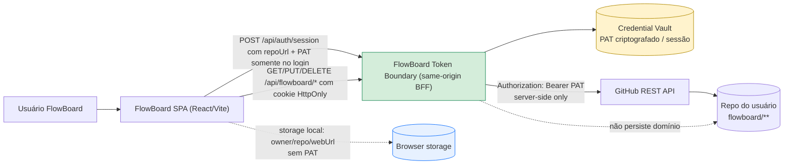
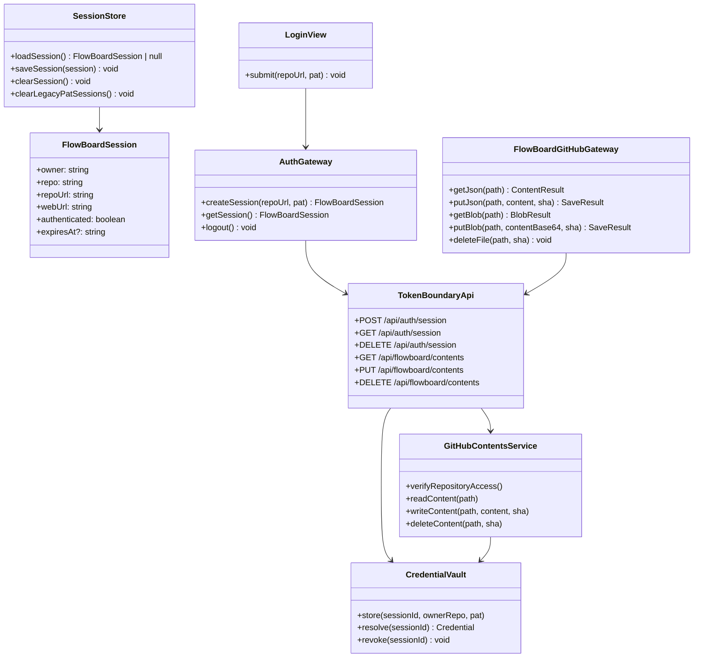
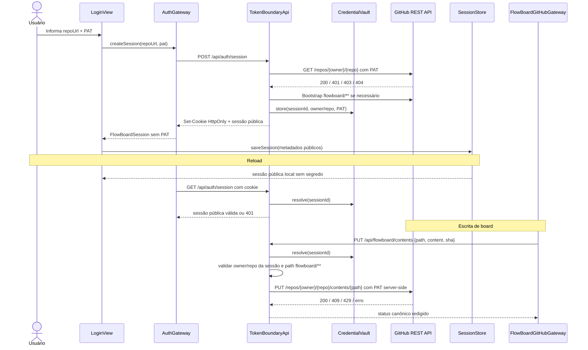

# Architecture Review Document — Fronteira segura para token GitHub

> Versão: v1.0 | Feature: `secure-github-token-boundary` | Baseado em: `.memory-bank/specs/secure-github-token-boundary/spec-feature.md`

---

## 1. Contexto

### 1.1 Resumo da feature

O FlowBoard hoje usa `GitHubContentsClient` no browser com `Authorization: Bearer <PAT>` e persiste a sessão em `localStorage` via `sessionStore.ts`, incluindo `pat`. A feature troca essa fronteira: o PAT pode ser digitado para iniciar uma sessão, mas deixa de existir no modelo de sessão restaurável pela SPA e deixa de assinar requests GitHub a partir do JavaScript do cliente.

A fonte de verdade dos dados de domínio permanece o repositório GitHub do usuário. A nova camada só pode guardar credencial/sessão e intermediar requests; não pode persistir catálogo, boards, cards, horas ou anexos como dados autoritativos.

### 1.2 Domínios impactados

| Domínio / módulo | Impacto |
|---|---|
| `src/infrastructure/session` | `FlowBoardSession` deve virar sessão pública sem PAT; `loadSession` deve limpar sessões legadas com PAT em `localStorage` e `sessionStorage`. |
| `src/infrastructure/github` | `GitHubContentsClient` deixa de ser construído com PAT no browser; a SPA deve usar um gateway same-origin para operações FlowBoard. |
| `src/features/auth` | Login passa a chamar a fronteira segura para estabelecer sessão; PAT deve sair do estado controlado após sucesso e nunca ser salvo. |
| `src/features/app`, `board`, `boards`, `hours` | Props e hooks que recebem `FlowBoardSession` não podem depender de `session.pat`; persistência deve usar o novo gateway. |
| `src/infrastructure/persistence` | `boardRepository` deve continuar expressando leitura/escrita de catálogo e board com SHA, mas por cliente/gateway sem PAT no browser. |
| `tests/e2e` | Setup deve provar ausência de PAT em storage e ausência de request direto da SPA para GitHub com `Authorization`. |

### 1.3 Restrições arquiteturais

| ID | Restrição |
|---|---|
| RA-01 | Constitution II continua exigindo dados de domínio somente no repositório GitHub configurado; a exceção nova é apenas credencial/sessão na fronteira. |
| RA-02 | Constitution III exige ADR atualizado para qualquer mudança em PAT/sessão; ADR-009 registra a nova direção. |
| RA-03 | ADR-002, ADR-005 e ADR-008 seguem vigentes: layout `flowboard/**`, SHA para concorrência e anexos no GitHub. |
| RA-04 | GitHub Enterprise e `apiBase` customizado permanecem fora do MVP; origem GitHub suportada continua `github.com` / `https://api.github.com`. |
| RA-05 | Sessões legadas com PAT devem ser removidas fail-closed; não há migração silenciosa do PAT legado. |
| RA-06 | A primeira entrega aceita risco residual durante digitação do PAT; OAuth/GitHub App completo é alternativa futura, não obrigação desta feature. |

## 2. Padrão arquitetural selecionado

### 2.1 Decisão

**Padrão adotado:** BFF/proxy same-origin de credencial + gateway de persistência no cliente.

**Justificativa:** o padrão dominante do repo é SPA React com separação `domain/`, `features/` e `infrastructure/`. Essa separação deve continuar no cliente, mas a decisão antiga de `infrastructure/github/client.ts` carregar PAT no browser não satisfaz RF01-RF05. O BFF/proxy é a menor mudança de topologia que remove o segredo do JavaScript restaurável, preserva URL + PAT na primeira conexão e mantém o GitHub como repositório autoritativo.

No cliente, a mudança deve aparecer como substituição do adaptador: componentes continuam dependendo de `FlowBoardSession` pública e de repositórios/gateways de infraestrutura, não de PAT. No servidor/fronteira, a responsabilidade é validar sessão, recuperar a credencial do vault, assinar requests à GitHub REST API, mapear erros e aplicar escopo/path allowlist.

### 2.2 Alternativas avaliadas

| Alternativa | Benefício | Custo / risco | Decisão |
|---|---|---|---|
| Manter PAT no cliente com hardening | Menor mudança de código e hosting; preserva static-only. | Não cumpre RF04/RF05; XSS de mesmo origin ainda alcança token ou cliente autenticado; armazenamento cifrado pela própria SPA é reversível pelo atacante. | Rejeitada. |
| BFF/proxy de credencial same-origin | Remove PAT de storage/props/cliente GitHub; preserva GitHub como fonte de verdade; compatível com fluxo atual de PAT. | Exige runtime de API, vault, cookies HttpOnly e controles CSRF/origin. | Selecionada. |
| OAuth App completo | Elimina PAT manual para usuário final; fluxo conhecido. | Exige app registration, callback, client secret no servidor, tokens OAuth e escopos menos finos; GitHub recomenda considerar GitHub App. | Rejeitada para v1. |
| GitHub App completo | Permissões finas por repositório, tokens de instalação curtos e bom caminho futuro; docs GitHub indicam installation token com expiração curta. | Exige instalação do App, private key/JWT, mapeamento installation id e UX nova de consentimento. | Deferida para fase futura. |

Referências técnicas externas consultadas:

- GitHub Docs — OAuth Apps: https://docs.github.com/en/apps/oauth-apps/building-oauth-apps/authorizing-oauth-apps
- GitHub Docs — GitHub App installation authentication: https://docs.github.com/en/apps/creating-github-apps/authenticating-with-a-github-app/authenticating-as-a-github-app-installation
- GitHub Docs — generating installation access tokens: https://docs.github.com/en/apps/creating-github-apps/authenticating-with-a-github-app/generating-an-installation-access-token-for-a-github-app

Essas referências indicam que GitHub Apps oferecem permissões finas e tokens de instalação de curta duração, mas exigem fluxo operacional maior.

### 2.3 Consistência com a arquitetura existente

- **Padrão dominante detectado:** SPA React com camadas `domain/`, `features/` e `infrastructure/`; domínio puro e persistência GitHub por adaptador.
- **Esta feature:** preserva a camada de domínio e o layout de dados, mas introduz uma fronteira server-side mandatória para credenciais. A divergência é justificada porque o requisito de segurança contradiz explicitamente ADR-001/ADR-004 no ponto "PAT no browser".
- **Mudança de deployment:** static hosting puro deixa de ser suficiente para fluxos autenticados. O planner deve escolher runtime/API same-origin compatível com Vite/React sem mover dados de domínio para backend.

## 3. Diagramas

### 3.1 Visão de sistema



### 3.2 Componentes e responsabilidades



### 3.3 Fluxo de dados — conexão, reload e escrita



## 4. Architecture Decision Records

### ADRs criados nesta feature

| Arquivo | Decisão | Impacto na implementação |
|---|---|---|
| `.memory-bank/adrs/009-flowboard-secure-github-token-boundary.md` | Introduzir BFF/proxy same-origin para credenciais GitHub e remover PAT do modelo de sessão do browser. | Planner deve substituir `GitHubContentsClient` autenticado no cliente por gateways same-origin e criar contrato de sessão segura. |

### ADRs preexistentes referenciados

| Arquivo | Decisão | Guardrail ativo |
|---|---|---|
| `.memory-bank/adrs/001-flowboard-spa-github-persistence.md` | SPA persistia somente via GitHub API com PAT do usuário. | Mantém "dados de domínio somente no GitHub"; o trecho "cliente direto com PAT" fica supersedido por ADR-009. |
| `.memory-bank/adrs/002-flowboard-json-repository-layout.md` | `flowboard/catalog.json` + `flowboard/boards/<boardId>.json`. | A fronteira não pode alterar layout nem virar fonte de verdade. |
| `.memory-bank/adrs/003-flowboard-domain-and-ui-architecture.md` | Domínio puro + `features/` + `infrastructure/`. | UI orquestra; regras de domínio continuam fora do BFF. |
| `.memory-bank/adrs/004-flowboard-session-and-pat-storage.md` | Autorizava PAT em `sessionStorage` no MVP, depois código migrou para `localStorage`. | Supersedido por ADR-009; PAT em storage é proibido. |
| `.memory-bank/adrs/005-flowboard-github-concurrency.md` | Escrita por SHA e conflitos 409 observáveis. | BFF deve preservar SHA, 409 e 429. |
| `.memory-bank/adrs/008-flowboard-card-attachments-github.md` | Anexos em `flowboard/attachments/**` via Contents API. | Gateway deve suportar blob/base64 e DELETE com SHA. |

## 5. Stack tecnológica

| Componente | Tecnologia / lib | Versão | Justificativa |
|---|---|---:|---|
| Cliente | React | ^19.2.4 | Padrão do projeto. |
| Build cliente | Vite | ^8.0.4 | Padrão do projeto. |
| Linguagem | TypeScript | ~6.0.2 | Padrão do projeto; deve cobrir client e boundary se implementado no repo. |
| Testes unitários | Vitest + happy-dom | ^4.1.4 | Padrão do projeto para sessão/gateways. |
| E2E | Playwright | ^1.57.0 | Necessário para provar ausência de PAT em storage e requests. |
| Boundary runtime | API same-origin Node/serverless em TypeScript | A definir no IPD | Não existe backend atual; decisão arquitetural exige runtime. Planner deve escolher implementação mínima sem backend de domínio. |
| Sessão | Cookie `HttpOnly`, `Secure`, `SameSite=Lax` ou mais restrito | N/A | Capacidade autenticada inacessível a JavaScript. |
| Vault de credenciais | Store server-side com expiração e revogação | A definir no IPD | Pode ser memória em dev; produção precisa sobreviver a reload e logout sem gravar domínio. |

## 6. Contrato de interface para o planner

O planner deve materializar rotas concretas. A superfície abaixo resolve a ressalva do spec-reviewer sobre ausência de método/rota na TSD.

| Operação | Método e rota | Request | Sucesso | Falhas canônicas |
|---|---|---|---|---|
| Iniciar sessão segura | `POST /api/auth/session` | `{ repoUrl, pat }` | `201` + sessão pública + cookie HttpOnly | `400`, `401`, `403`, `404`, `502/503` |
| Consultar sessão atual | `GET /api/auth/session` | cookie somente | `200` + sessão pública | `401` |
| Encerrar sessão | `DELETE /api/auth/session` | cookie somente | `204` ou `{ loggedOut: true }` | Deve ser idempotente; `204` aceitável mesmo sem sessão. |
| Ler conteúdo FlowBoard | `GET /api/flowboard/contents?path=&kind=json|blob` | cookie + path permitido | `200` + `{ sha, content }` | `401`, `403`, `404`, `422`, `429`, `502/503` |
| Escrever conteúdo FlowBoard | `PUT /api/flowboard/contents` | `{ path, kind, content, sha?, message? }` | `200` + `{ ok, sha? }` | `400`, `401`, `403`, `409`, `422`, `429`, `502/503` |
| Excluir conteúdo FlowBoard | `DELETE /api/flowboard/contents` | `{ path, sha, message? }` | `200` + `{ ok: true }` ou `204` | `400`, `401`, `403`, `404`, `409`, `429`, `502/503` |

**Decisão sobre conteúdo inválido:** JSON remoto malformado ou inválido para schema mínimo FlowBoard deve ser exposto como `422` com código redigido, por exemplo `remote_content_invalid`. Indisponibilidade, timeout ou payload inesperado da GitHub API permanece `502/503`. Isso separa dado de domínio corrompido de falha externa.

## 7. Riscos e guardrails arquiteturais

### 7.1 Riscos identificados

- **R-01 — BFF virar backend de domínio:** a fronteira pode acumular cache/estado de boards por conveniência.
  - Probabilidade: Média
  - Impacto: Alto
  - Mitigação: contratos só transportam conteúdo/sha; vault guarda apenas credencial/sessão; ADR-009 GA-009-05 é mandatória.

- **R-02 — CSRF em operações autenticadas por cookie:** cookie HttpOnly protege contra leitura por JS, mas browser pode enviá-lo automaticamente.
  - Probabilidade: Média
  - Impacto: Alto
  - Mitigação: `SameSite=Lax` ou `Strict`, checagem de `Origin`/`Referer`, métodos não-GET com token CSRF não secreto quando necessário, e `Content-Type` restrito.

- **R-03 — Exposição do PAT em logs da fronteira:** erro bruto ou body de login pode vazar segredo.
  - Probabilidade: Média
  - Impacto: Alto
  - Mitigação: redaction centralizada; não logar body de auth; testes unitários para mensagens de erro sem token.

- **R-04 — Quebra de E2E existente com `storageState`:** a sessão deixa de ser recuperável por PAT em `localStorage`.
  - Probabilidade: Alta
  - Impacto: Médio
  - Mitigação: setup E2E deve autenticar via UI/API e persistir cookies HttpOnly no storage state; assertions devem confirmar ausência de PAT em storage.

- **R-05 — Static deploy incompatível:** Vite build atual gera SPA estática com CSP `connect-src 'self' https://api.github.com`.
  - Probabilidade: Alta
  - Impacto: Médio
  - Mitigação: IPD deve incluir deployment/runtime local e produção; CSP deve ser atualizada para usar a fronteira same-origin.

### 7.2 Guardrails para o impl-planner

- **GA-01:** Remover `pat` de `FlowBoardSession`; nenhum componente React deve receber PAT por props, contexto ou estado restaurável.
- **GA-02:** `sessionStore.ts` deve remover sessões legadas com `pat` em `localStorage` e `sessionStorage`, tratar como sem sessão e não copiar legado para storage novo.
- **GA-03:** `LoginView` deve chamar `AuthGateway.createSession`; `GitHubContentsClient` com token não deve ser instanciado no browser.
- **GA-04:** Introduzir `FlowBoardGitHubGateway` ou interface equivalente para preservar chamadas de persistência sem expor PAT.
- **GA-05:** A fronteira deve validar que toda operação autenticada usa o `owner/repo` da sessão; o cliente não pode escolher outro repo por body/query.
- **GA-06:** A fronteira deve restringir paths a `flowboard/catalog.json`, `flowboard/boards/**` e `flowboard/attachments/**`, rejeitando path traversal, path absoluto e namespaces fora de `flowboard/`.
- **GA-07:** Preservar semântica GitHub de SHA, `409` e `429` em `boardRepository`, anexos e fluxos de retry.
- **GA-08:** Redigir todos os erros antes de retornar ao browser; respostas e logs não podem conter PAT, header `Authorization`, stack trace sensível ou body bruto de login.
- **GA-09:** Logout deve limpar metadados locais e chamar a fronteira para revogar o vault/session id; repetição deve ser segura.
- **GA-10:** Testes unitários devem cobrir sessão sem PAT, limpeza de legado, path allowlist e mapeamento de erros; E2E deve cobrir login, reload, logout e inspeção de storage/requests.
- **GA-11:** Não alterar schema de `flowboard/**` nesta feature; qualquer mudança de catálogo, board, horas ou anexos exige spec/ADR própria.
- **GA-12:** Registrar no README/avisos o risco residual de exposição durante digitação do PAT enquanto GitHub App/OAuth completo não for adotado.

## 8. Handoff para o impl-planner

```text
[HANDOFF ARCHITECT -> PLANO]
TSD: .memory-bank/specs/secure-github-token-boundary/spec-feature.md
ARD: .memory-bank/specs/secure-github-token-boundary/architect-feature.md
ADR: .memory-bank/adrs/009-flowboard-secure-github-token-boundary.md

Feature: secure-github-token-boundary

Padrão arquitetural a implementar:
  BFF/proxy same-origin de credencial + gateway de persistência no cliente.

Estrutura recomendada (nomes finais podem variar, responsabilidades não):
  apps/flowboard/src/infrastructure/session/
    sessionStore.ts              (sessão pública, limpeza de legado)
  apps/flowboard/src/infrastructure/auth/
    authGateway.ts               (POST/GET/DELETE /api/auth/session)
  apps/flowboard/src/infrastructure/github/
    flowBoardGitHubGateway.ts    (cliente same-origin para contents/blob/delete)
    fromSession.ts               (não pode criar cliente com PAT no browser)
  boundary/server ou api/
    auth routes                  (create/current/logout)
    flowboard contents routes    (read/write/delete)
    credentialVault              (store/resolve/revoke credencial)
    githubContentsService        (assina GitHub server-side)

Componentes a criar/modificar:
  - FlowBoardSession: metadados públicos sem PAT.
  - AuthGateway: estabelece, consulta e encerra sessão segura.
  - FlowBoardGitHubGateway: substitui uso browser direto do GitHubContentsClient.
  - TokenBoundaryApi: aplica cookie, escopo owner/repo, allowlist de path e redaction.
  - CredentialVault: armazena credencial GitHub fora da SPA, com expiração e revogação.
  - GitHubContentsService: encapsula REST GitHub server-side preservando SHA/409/429.

Fluxo principal:
  LoginView -> AuthGateway -> TokenBoundaryApi -> GitHub -> CredentialVault -> sessão pública.
  Features -> boardRepository/attachmentSync -> FlowBoardGitHubGateway -> TokenBoundaryApi -> GitHub.

ADRs com impacto direto:
  - ADR-009: PAT no browser e chamadas GitHub diretas autenticadas pela SPA ficam proibidos.
  - ADR-002/005/008: layout, SHA e anexos continuam iguais e devem ser preservados.

Guardrails obrigatórios:
  - Cumprir GA-01 a GA-12 da seção 7.2.
  - Resolver explicitamente runtime/deploy same-origin; static-only não atende mais.
  - Não implementar OAuth/GitHub App nesta primeira entrega sem nova decisão de produto.
```

## 9. Score de confiança

| Critério | Pontos |
|---|---:|
| TSD lido por completo | 20 |
| Padrão dominante identificado | 20 |
| Stack confirmada via arquivos | 15 |
| Pontos de decisão mapeados | 20 |
| Restrições não-funcionais claras | 15 |
| Fora de escopo definido | 10 |
| **Total** | **100/100** |

Confiança operacional aplicada: **94/100**. A redução reflete uma decisão pendente de planner sobre a runtime/API concreta, não uma lacuna na direção arquitetural.

## 10. Metadata

```json
{
  "agent": "architect",
  "status": "success",
  "confidence_score": 94,
  "ard_path": ".memory-bank/specs/secure-github-token-boundary/architect-feature.md",
  "adrs_created": ["009-flowboard-secure-github-token-boundary.md"],
  "adrs_referenced": [
    "001-flowboard-spa-github-persistence.md",
    "002-flowboard-json-repository-layout.md",
    "003-flowboard-domain-and-ui-architecture.md",
    "004-flowboard-session-and-pat-storage.md",
    "005-flowboard-github-concurrency.md",
    "008-flowboard-card-attachments-github.md"
  ],
  "pattern_selected": "BFF/proxy same-origin de credencial + gateway de persistência no cliente",
  "complexity": "L",
  "guardrails_count": 12
}
```
